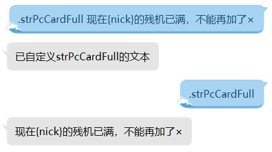

# 炼骰手册

<center><h1>DiceMaid CookBook<br>骰娘是怎样炼成的</h1><h2>Dice!常见问题手册</h2></center>

## 前言

本手册面向Dice!V2.4.0以上的用户以及对应机器人的使用者，用于解答使用、搭建、维护、开发方面的各类问题，作为Master Manual和User Manual的补充。相对于两份手册与版本同步，本手册更多地提供纲领性说明。如有疏漏，欢迎提出。可通过向骰娘.send [发送消息内容] 发送信息。

对骰娘有了解的用户可以跳过第一部分，不自建骰娘的可以忽略第四、第五部分。本手册内容并非必须记住，但希望能在需要查阅时像开卷考试一样熟练。


<p style="text-align: right">安研色&溯洄<br>QQ:3258528467</p>

## 一、骰娘是什么

骰娘是QQ账号、功能核心(掷骰)、非核心功能、(虚拟形象)相统一的有机体。一位骰娘是一个能响应掷骰功能指令的QQ(机器人)，处理来自QQ的消息并通过QQ发送回复。本手册所述骰娘一般为泛指，部分语境下描述的是Dice!插件专有的骰娘特性。

### 为什么需要骰娘？

**QQ线上玩家**玩线下游戏所需要的**实体骰子**的替代，即“**玩家共同见证的随机数生成器**”，是骰娘的**功能核心**。当玩家需要使用功能时，发送特定格式的消息，骰娘即会响应并回复结果。

>KP: 你骰一个1D100
>
>PL: .r 1d100
>
>DiceMaid: PC掷骰: D100=100

#### 为什么骰娘为TRPG（跑团）服务？

开门见山地说，**Dice!是一款TRPG掷骰服务插件**，针对角色扮演游戏和特定游戏规则(COC/DND/WOD)特化了高级功能，简化了部分游戏内琐碎重复的操作（记录属性、理智检定、成长检定、奖励惩罚骰、计算成功等级、加骰等），帮助玩家专注于扮演体验，同时降低跑团记录整理的工作量。

当然在理论上，骰娘可以服务于所有需要实体骰子的场合。如果哪天你玩祸不单行/飞行棋/小黑屋/教改风云把骰子玩丢了，你一样可以使用骰娘来进行游戏。但对线下玩家而言，骰娘对实体骰子没有明显优势，因此在线上玩家不方便使用实体骰子的场合，骰娘才有其优越性。

相应地，文字类游戏本身适合在QQ上进行，而桌上角色扮演游戏对地图/棋盘和指示物依赖低，操作更偏向于有随机性的文游，骰娘由此与QQ跑团相辅相成。实际上你也可以用骰娘在QQ上开一局飞行棋，但如果可以，为什么不直接在平台上玩飞行棋呢？

### 为什么是骰“娘”？

“骰娘”是一个习称，因为元祖级公共掷骰机器人均为女性形象。现在“骰娘”的形象可以是骰郎、伪娘、AI、宠物、小精灵、神话生物、SCP收容物……事实上，一个掷骰机器人甚至可以没有任何形象设定。直至今天，绝大多数的主人仍然希望见到女性形象的骰子来服侍广大玩家。因此本手册沿用这一称呼，以指代任何形象的掷骰机器人。

### 什么是骰娘的主人/骰主？

主人是对骰娘有所有权、控制权的人，拥有插件内最高管理权限。这里认为主人持有骰娘QQ账号，控制骰娘酷Q所在电脑/服务器，即使实际上可能并非由同一个人负责。在Dice!较新版本中，获取和调用主人权限的指令为.master，因此主人习称为Master。

成为一名骰主并没有太多要求，因为酷Q air/Mirai是免费软件，Dice!插件免费且开源，因此顺着步骤操作很容易拥有一只属于自己的骰娘。如果实在不想自己动手，在QQ群开出百元一年全托管不含人设的价位，会有许多人乐意效劳的。*目前为止，已知作为Dice!系列骰娘主人的QQ用户有至少1000位以上。*

### 什么是公骰？

与仅供自己或亲友使用的骰娘相对，公骰是开放公开服务，可以免费供他人使用的骰娘。客人基本可以像邀请其他人一样邀请骰娘进群，而没有额外的申请步骤。一般而言，公骰也会相应地有更严格的规定，以保证对其他用户提供稳定的服务。公骰主人会花更多精力维护骰娘的运行，但也因暴露而有更高风险遭遇不可抗力的制裁。(仅供参考，公骰Master可能有不同的政策)

>请务必用对待女朋友的方式对待骰娘！
>
><div style="text-align: right">——溯洄《Dice! 掷骰机器人搭建说明》(这句话其实不是我说的——溯洄注)</div>

#### 公骰-官骰-私骰

（某系）**官骰**一般指掷骰插件开发者自主运营的骰娘，如Kokona是溯洄系（Dice!）的官骰，It's DiceBot是风羽系（CatDice）的官骰，奈梅斯/坂本酱是塔（斯塔尼亚）系的官骰，惠惠是惠系的官骰，『汪酱』是汪酱系列的官骰。因此在某些语境下，**私骰**指代的是**非官方**搭建运营的骰娘(私人所有)，如[TRPG私骰分享站](https://dicer.club/)指的就是个人搭建的骰娘。但在另一些语境下，私骰指代的是**不提供公共服务**、无主人许可不让碰的骰娘(私人使用)，对Dice!而言即**开启私用模式**的骰娘。一般而言“私骰”指代后者即**私用骰娘**。

### Dice!是什么？

Dice! 是一款开源免费，基于[酷Q](http://cqp.cc/) 或者[Mirai](https://github.com/mamoe/mirai) 的QQ掷骰机器人，由溯洄使用C++语言编写，主要由Visual Studio编译(现在也可以用GCC/Clang等)

## 二、骰娘怎么了

### 骰娘怎么被冻结了？

主人们为了维护骰娘账号往往需要与QQ安全中心打交道，尤其是[解除保护模式-QQ安全中心](https://aq.qq.com/cn2/login_limit/login_limit_index)。**骰娘是典型的QQ机器人**，轻易加入群聊，秒过陌生好友，以反人类的速度和频率同时在各个群发送消息，故本身**有较高的封禁概率**，而**踢出群聊、大量刷屏等操作**则会推动骰娘的暴露。因此，即使在日常运行时，骰娘也有可能被QQ安全中心检测识别为传播不良信息并封禁。而如果对骰娘进行举报，则会有较高概率被QQ所通过。因此，骰娘和用户都需要对骰娘突然被冻结做好准备。

用户在遭遇骰娘冻结的情况时，若相识可第一时间提醒骰娘主人解冻。但有时**保持冻结也是一种保护**，因为经验表明安全中心会对近期被冻结的骰娘进行复查，急于恢复使用有更高概率令骰娘遭遇反复冻结。

### 骰娘怎么拉黑我了？【版本限定】

“拉黑”是对**向特定用户或群停止服务**的习称。骰娘在对特定用户停止服务后，会停止响应指令，清查与用户的共同群并视情况退群，默认会向用户发送拉黑通知（主人可以在个性化时取消通知）。拉黑引出了骰娘和用户群间的孤立与反孤立，就像学生时代的校园故事。但是仅此而已，骰娘不会对被拉黑的用户做出更多实质性惩罚，或者说，不能施加更多暴力。

Dice!内置三类自动拉黑机制：**移出群、群禁言、单人刷屏**，前两项拉黑所在群和操作者，后一项拉黑操作者。同时骰娘会生成warning，其他骰娘在接收到消息并验证可信后会同样做拉黑处理。*（注：在Dice!远古版本，骰娘缺少身份检测，会拉黑主人甚至自己。现在这种情况已经被排除了，骰娘会乖乖被主人口球。）*

内置拉黑机制**只是对用户协议通用条款的最基本实现**，**协议的最终解释权归主人所有**，主人完全可以手动停止对违反协议的特定用户或群的服务，特别是缺少自动判定条件的行为，如**教唆犯、连带责任、刷屏、敏感词等**，Dice!的开发者对一切拉黑等现象不负任何责任。

#### 如何恢复服务？

默认协议不包含恢复服务相关规定，因此唯一的途径是让事主同意撤销黑名单，即完全取决于*主人意愿*(所以去官方群是没有用的)。

**参考流程**（不同骰主并不通用）：

- 联系事主（指主人，不要指望找骰娘有回应），表达解黑意向
- 还原事发情形，表达态度
- 验证自己熟悉指令用法和用户协议，保证以后遵守协议
- 获得谅解并等待广播决议
- 

#### 云黑是什么？

“云黑”是对骰娘间不良记录共享机制的习称。Dice!**没有全体骰娘同步的黑名单**，只有供核验的不良记录库和骰娘对!warning指令的响应机制。骰娘在遭遇不良行为时会自动上传记录信息，其他骰娘在接收到warning指令后与云端通讯核验信息，确认无误后同步拉黑。骰娘的任何本地黑名单记录都最终受控于骰娘管理者，**骰娘永远拉黑不了自己的主人**。（如果有，那就用.master指令解除。）

#### 刷屏监测是什么？

骰娘会分别记录每个用户一段时间内的指令次数并折算指令频度，当某用户的频度达到不同阈值时，骰娘会分别初次警告、最终警告、拉黑用户。三个阈值相当于6次/30s、12次/30s、20次/30s。注意**刷屏的解释权归主人所有**，不要试探算法的底线，即**算法不判定刷屏≠主人不认为刷屏**。


触发警报后，一般需要等待至少半分钟至一分钟再使用指令，否则容易短时间多次触发。*例：某次结算成长累积频度到6，触发警报。这时停止指令，频度会从6逐渐降低至0。但如果在频度降到5时便等不及继续指令，频度重新达到6，再次触发警报。*

#### 解散群/移出讨论组算踢出吗？

骰娘不会意识到发生了什么，也不会触发拉黑。解散/移出之前dismiss能为骰娘管理群聊提供少许的方便。当然，骰主如果用PCQQ登录骰娘时收到了被移出讨论组的群聊系统消息，根据协议也是可以手动拉黑的。(仅供参考，不同master可能有不同政策)

#### 协议里没说不许这样啊？

这类问题只能向主人申诉争论。可以在不影响无关群氛围的前提下提出自己的意见。

#### 骰娘的规矩好麻烦怎么办？

参考第四部分，做自己骰娘的主人，这样就不用担心违反协议了——骰娘会永远信任自己的主人，无论被做什么都不会反抗。当然，找到一个信任自己的骰主，获得豁免级别的信任，就可以随便使用对方的骰娘了。

### 骰娘怎么没反应了？

首先从头像查看骰娘在线状态，确认骰娘是否在线，不在线自然不会响应。之后分情况讨论：

#### 私聊有回应，群内不响应

请检查日志，如果日志中有发送消息的记录证明你的消息被腾讯当作垃圾消息/广告等内
容拦截，无法正常发送。这一现象在新账号身上发生很频繁。请尝试正常使用此账号几天或
更换账号重试。此问题并非插件问题，也没有确切的解决方法。

#### 群内有回应，私聊不响应/暗骰不私聊

当骰娘与用户不是好友、私聊需要通过群聊窗口发起时，发送有概率发生错误：**找不到与对象的关系**。通过添加好友来修复这一错误。

### 装载其他应用后，骰娘不工作了怎么办？

请打开酷Q的应用面板，检查优先级，确保没有更高优先级插件拦截指令（数字越小，优先级越高，但只在10001到40000之间合法）。

## 三、骰娘怎么用

### 善于查表

用户要善于查指令（.help指令，或查看*用户手册*），骰主要善于查回执条目表、全局设置表（及时更新版本适配的*Master手册*，使用测试版本的需要适配*测试手册*）以上手册下载地址可以在[官方网站](https://kokona.tech) 找到。

### 指令怎么用？

<center></center>

**指令**是能触发骰娘响应的消息。所有的掷骰指令都以前缀标识符(.。!！之一)、指令名("r")、参数("d")构成。前缀标识符帮助骰娘快速过滤一般聊天消息，指令配合参数表达想要实现的功能。部分指令可忽略参数。**请养成参数之间带空格的好习惯！**完整指令说明请**熟读用户手册**，必要时对骰娘发送.help 指令，注意说明中**方括号表示转义，圆括号表示可省略，不要单纯替换而保留括号。**

*注：在Dice!2.3.8exp10之后，半角方括号[]会在录入角色卡表达式时用到*

<center></center>

##### 复数骰娘时怎么指名？

可以想象，存在一个群内同时存在多位骰娘的情况，而正常使用只需要用到一位骰娘，而其他骰娘则被希望不响应指令。此时，可以at指定骰娘并接指令，令指定骰娘响应；也可以停用其他骰娘的指令。当我们需要停用骰娘DiceMaid(123456789)的指令响应时，以下指令是等效的：

```
@DiceMaid .bot off
.bot off 6789
.bot off 123456789
```

类似地可以通过.bot on重新启用指令。

##### 今日人品高好还是低好？

Dice!2.3.6之后，今日人品在1-100的区间内均匀分布，解读**没有规定**。实际以骰娘文本描述为准。


### 怎么邀请骰娘？

**请确认熟悉骰娘指令！请确认同意骰娘协议！请确认邀请骰娘得到群内同意！** 默认协议下默认邀请前已完成确认。如果自己不是群管理或得到群主同意，请不要擅自邀请骰娘，因为你不能对骰娘负责，这同样也是对骰娘所进的群不负责任。

#### 认识要用的骰娘

QQ签名、说说动态、help文档都是骰娘展示自己的空间。为你和骰娘将来的体验负责，在使用前请尽可能了解你选中的骰娘。

#### 一定要给骰娘管理吗？

Dice!较新版本中，给予骰娘群权限的群能得到更多信任，这暗示群主授予骰娘管理员权限。然而，由于对骰娘全部功能的未知，这种轻率地授予信任可能反过来带来风险，如擅自禁言或踢出群员。现在有越来越丰富的方式建立骰娘与群之间的互信，因此我们同更推荐群主规训群管理并申请群白名单，特别是在骰娘多且无法同时当管理时。(以上仅供参考)

### 可以收集骰娘吗？

没有强制约束。但注意主人是知道骰娘被谁加好友、被拉进了什么群的。

#### 骰娘可以见一个加一个好友吗？

没有强制约束，但请克制：骰娘是**用完好友位也加不过来**的；**频繁加好友会被QQ临时限制好友功能**；占用骰娘好友位又放置不管，这会冒犯到一部分骰主。

#### 可以拉群把骰娘都拐进来吗？

请慎重：对部分骰娘而言，邀请进无关群**本身违反协议**；拉骰娘越随意，**不良行为的风险越高**；骰娘会在自动清理时自行离开。

### 可以调戏骰娘吗？

以下内容仅供参考，不同master可能对此问题由完全不同的想法，推荐先征求对方同意

骰娘的态度取决于主人对骰娘的定位。如果不清楚或没把握，请放弃这个想法。想象对一个现实的陌生人说出你要说的话会是什么样子。

**工具型骰娘**：骰娘是工具人。调戏=调戏一个没有感情的女仆

**替身型骰娘**/人机一体：骰娘是主人的假面/形象与主人统一。调戏=调戏骰主

**扮演型骰娘**(绊爱型)：骰娘是有独立人设的皮套，扮演者服务于形象。调戏=调戏骰娘的人设形象

**养成型骰娘**：骰娘是主人的梦中人具现化的对象。调戏=调戏主人的伴侣/情人/儿女

> 骰娘身上每一处萌点，都来自主人藏在骨子里的可爱。
>
> <div style="text-align: right">——安研色《自己现说的》</div>

#### 可以私聊骰娘吗？

**尽量避免发送不当内容**。(Dice!官方无法保证任何机器人的安全性，无法排除对方恶意利用聊天内容的可能，对于任何机器人都请谨慎对待，请不要发送包括但不限于隐私信息，密码，信用卡号等，在有骰娘的群也是如此)

#### 可以金钱援助解锁交际功能吗？

欢迎用户为骰娘提供QQ会员开通、酷Q pro续费、服务器续费等援助。至于骰娘的回报……说不定骰运会好点哦。

#### 可以拿骰娘当作文件中转/记录吗？

公共骰娘偶尔会收到没头没尾的扮演文本、模组内容、人物卡和奇奇怪怪的文件，因为会有人把这当作存储临时内容的窗口。请尽量使用QQ自带的文件助手替代，因为一旦发粉红内容给骰娘，骰娘还接收了的话，事情就比较尴尬了。(我就收到过——溯洄)

## 四、骰娘怎么做

简而言之：准备一个干净的QQ号，[下载一份酷Q](https://cqp.cc/t/23253) 或者[Mirai](https://github.com/mamoe/mirai)，装入Dice插件，用QQ账号密码登录酷Q（可能需要登录验证），在应用管理内启用应用后，一只新骰娘就诞生了。

整合包可以在[官方网站](https://kokona.tech) 找到下载地址

### 什么是酷Q【酷Q】？

酷Q是一款QQ机器人软件。简单理解，酷Q利用QQ协议假冒成设备上的QQ进行登录，调用QQ的接口，接收QQ的事件。正常QQ会把接收的消息放到交互窗口供用户响应，酷Q则会调用库中插件进行处理。

> 酷Q是一款智能机器人软件，**严禁将酷Q用于违法用途**（如发送广告/群发/诈骗、色情、政治等内容）。
>
> 酷Q是一款智能机器人软件，由应用提供群管理、智能对话、好友互动、生活助理等智能功能。
>
> **您不得利用本软件从事赌博（《刑法》第三百零三条）、传播色情（《刑法》第三百六十四条）、诈骗（《刑法》第二百六十六条）等违法行为。**
>
> ​			——酷Q官网

酷Q使用易语言编写，只提供运行在 Windows 平台的版本，在 Mac 或 Linux 平台需要自行搭建 wine 环境或使用 Docker 映像。


#### 酷Q做不到什么【酷Q】？

（酷Q自带的接口监测不到或处理不了）拉取讨论组成员列表、监控讨论组移出、监控群解散、监控消息撤回（被撤回的消息记录不会删除）

酷Q不会处理离线时QQ收到的消息。因此**离线时被禁言、踢出无法追溯**。

#### 为什么同一个酷Q文件夹不能多开【酷Q】？

电脑端只需要安装一个PC版QQ就能多开，因为每个登录QQ账户的相关数据有各自的文件夹，不会冲突。而酷Q配置文件和数据存档的相对路径都是固定的 *（除了日志存放路径）* ，因此**想要多开多少个骰娘，就得准备多少酷Q文件夹**。建议在下载酷Q后留一份备份，以免要多开时重新下载。

### 怎么安装插件/认主？

对于*酷Q*:
将插件cpk放入准备好的酷Q文件夹的app文件夹下，重载应用。


对于*Mirai*:
安装Mirai-Native, 将插件的dll和json放入plugins/MiraiNative/plugins文件夹，重载应用

开启Master模式有两种方法:

1. 点击菜单的M综合管理-Master设置，在输入框内输入MasterQQ，点击设置。Mirai用户请右键菜单栏内的流泪猫猫头。

2. 点击菜单的Master模式切换，开启后第一个对骰娘.master (public)的用户将获得骰娘的唯一Master权限。Mirai用户请右键菜单栏内的流泪猫猫头。


#### 认主都有什么用？

监控骰娘活动，指令自定义骰娘文本，调节骰娘的好友申请、群邀请等全局设置，远程控制骰娘言行。刷屏、禁言、踢自己的骰娘不会被处分。

#### 应用菜单在哪儿？

右键点击悬浮窗->【应用】->【应用管理】->【菜单】 或 右键点击悬浮窗->【应用】->【Dice!】->[菜单选项]。 Mirai用户请右键菜单栏内的流泪猫猫头。

<center>

#### 悬浮窗显示的是什么？

悬浮窗默认显示每分钟**结束应用处理**的消息数，一般不超过千条

### 如何维持骰娘运行？

#### 保证开机！/关机后骰娘就没反应了么？

**想象一个离线的QQ一直对你发消息？** 骰娘的事件和消息是由酷Q的进程处理的，骰娘保持运行状态要求酷Q保持运行状态，且网络正常。运行骰娘需要一直保持软件开启，因此除非短时间使用，推荐使用云服务器。由于酷Q Air使用安卓端QQ协议，因此不能和手机QQ同时使用 (包含Android QQ, iOS QQ 以及轻聊版)，推荐使用小号登录。酷Q Pro和Mirai可以使用平板协议，这样就不会产生冲突了。

#### 保护骰娘的QQ账号

QQ是骰娘的载体，一个QQ被永久冻结的骰娘除了换号转生，只有毕业的结局。因此，维护骰娘的首要任务，是保证骰娘QQ免受制裁（屏蔽消息、屏蔽空间、冻结封禁等）。而骰娘作为一类QQ机器人，在服务的过程中必然承担被制裁的风险。

为了降低封禁风险，请避免骰娘频繁被踢出群或大量发送消息。善用黑名单功能，主人有权利自行修改骰娘的用户协议，必要时完全可以自行.admin blackqq [用户qq] 拉黑[用户qq]

##### 新骰娘号怎么养？

新注册或长期未用的QQ账号不宜立即作为骰娘投入使用，建议先作为正常用户使用、聊天。尽可能降低**异地/陌生ip、陌生设备登录**情形下的暴露风险。

#### 定期清理文件

仅限酷Q, Mirai不会记录日志

骰娘的日志记录和缓存图片会随着运行时长不断积累，并逐渐挤占存储空间，因此需要定期清理。


#### 耗用资源的操作错开进行【版本限定】

骰娘初始会设置在四点执行一次自动保存，五点时执行一次黑名单群清理。如果多只骰娘在同一系统上运行，同一时刻处理会集中在一点产生大量的资源占用，使CPU占用飚升。最好避免这种情形，比如令骰娘自动保存/清理的时间错开几分钟。

#### 骰娘怎么重启后没保存？

骰娘在运行时产生的数据保存在内存中，需要保存到（硬盘）存档文件夹内，才能在下次启动时读取。酷Q在应用停用/退出时会调用内部事件，插件也会在此时自动保存存档，**关机时终止酷Q进程不会调用酷Q的应用退出事件**。因此不到万不得已，**不要未关闭酷Q就重启设备**。

目前，部分修改频率较低的全局设置实现了即改即存，但角色卡属性等修改频繁的数据仍然需要在停用/退出时存入文件或手动保存。

#### 保证插件的运行环境

##### 监控CPU和内存占用【版本限定】

555版本后，插件会每半小时一次检测系统的CPU和内存占用。当占用率（百分比）超过设定的阈值（初始值90）时，会自动告警。服务器**切忌等内存占用100%后再反应**，否则可能无法远程连接成功，以免被迫重启服务器。**选择一家省心服务商**的省心服务器会降低很多不必要的精力耗费，免于发包被网关拦截、资源管理器内存随时间占用增长等烦恼。

##### 服务器要多什么配置？

不考虑其他插件，Linux上运行骰子至少要128MB内存，Windows要1G内存；硬盘需要1G，容量越大，必要的清理文件频率就越低；CPU一般都够用。Shiki序列至今仍有一只官骰，蜗居在256MB内存的服务器上（$11.25一年）。

#### 控制所在群的数量低于500【仅限酷Q】

受接口限制，骰娘拉取的群列表长度上限为500。因此，当骰娘需要清查黑名单用户共同群或清群时，如果所在群数超过500，不在列表内的群就会免于清理。而这些群同样无法正常使用群管功能。因此，请定时清群。

Mirai不受此限制

#### 怎样在运行同时登录骰娘QQ？【仅限酷Q】

Mirai默认使用平板协议，无需额外设置

对于*酷Q*:

QQ允许电脑端、手机端、平板端同时登录，因此可以**使用与酷Q错开的登录设备**来同时在线。酷Q默认使用QQ手机端进行登录，不影响主人使用QQPC版或QQHD登录骰娘QQ。如果一定要使用手机QQ登录，可以使用付费的酷Q pro并将所用QQ协议修改为HD版。

具体操作：


打开"[酷Q根目录]\conf\CQP.cfg"(使用记事本即可)
如果里面已经有[Dev]段，请在其下一行输入Platform=2
如果里面没有[Dev]段，请在文件最后加入

```ini
[Dev]
Platform=2
```

注: Platform=2代表采用安卓平板协议，Platform=0代表默认安卓QQ协议，Platform=4代表企业 QQ(普通账号无法登陆)，Platform=5代表MacQQ(与 PCQQ 冲突)

### 骰娘怎么运营？

#### 可以把自己做成骰娘吗？

不必须用小号，但是会影响你主号的使用，所以推荐用小号。为了避免因被禁言或踢出，制造不必要的麻烦，**请提前关闭本体的不良行为监听，给不作为骰娘使用的群加免黑或忽略**。由于随时有被腾讯封号的危险，请保证主号没有依赖于QQ的事务。使用酷Q air的情况下，注意有些功能是手机QQ限定的。

#### 需要酷Q pro吗？

**可选**。发图、语音、点赞、撤回、禁言功能需要[购买pro](https://cqp.me/user/buycqkey)方可使用，但这**均与Dice!核心功能无关**。

【时效性注意】考虑长期购买，最优惠的支付方式为先购买1个月(￥12)授权，然后每次续费6个月(￥54)，以此方式，授权开销为￥3+9×授权月数

#### 骰娘有什么注意/禁忌？

**不要作弊！不要作弊！不要作弊！** 公平随机是骰娘的生命。Dice!现在没有、将来也不会有操纵单个掷骰结果的功能。按经验，出千的骰娘需要向用户挨个谢罪并自愿█████，请不要放过这样的骰娘。

除此之外，骰娘是主人的私有物，完全受主人意愿支配。但如果要在非自己的群使用，也要注意考虑其他用户的体验。如：保证其他所有插件的功能在群内可开关，提前告知会调用群管理权限的功能，可以正常响应送出指令（禁止禁止!dismiss），不会频繁回复常用语句，避免使用禁言或踢出功能的插件，窥屏避免随意插话和多余操作，等等。

#### 限定骰娘的服务范围【可选】

不少公骰在默认协议的基础上追加“禁止非跑团群使用”的内容，既因为这是Dice!骰娘设计的出发点，也为了让骰娘留在一个关系密切的用户网络内，这样协议的效力相对有保障。跑团用户从素质上并不比其他用户更守序，但因关系网络的存在而更易接受协议约束。对于一名和骰娘用户群关联甚少的陌生用户而言，被骰娘停止服务是一项零损失的惩罚。这也是邀请者需要为不负责任地邀请承担连坐的一项理由——不负责任地邀请导致骰娘在陌生且危险的群体中流传。

#### 需要有自己的骰娘群吗？

**强烈推荐**为自家骰娘运营一个用户群，只要骰主认为用户数足够多。专门的用户群可以方便骰主及时通知骰娘冻结、维护等消息，处理许可申请、解黑等事宜，与用户协商沟通骰娘个性化细节，发布自定义列表，也更容易培养有黏性的忠诚用户。一批忠诚用户比几倍的路人用户更有价值：更有可能遵守用户协议；加入不可控陌生群的风险更低；可以更稳定地吸收用户；更容易得到打赏或推出其他增值服务，等等。

#### 骰娘可以用来营利吗？

对于使用Dice!及其任何衍生版本的骰娘而言，可以。Dice!源码遵循 AGPL3.0 协议，不限制复制、修改用于商用，但需要保留原作者署名。骰娘一般通过开放二维码投食来平衡服务器的支出（新年、情人节等节日是暗示投食的好时机）。骰主也允许收费提供掷骰服务，当然，就供求现状而言，要以这种方式盈利似乎有困难。

注意，如果要商业化，除了掷骰插件，请注意骰娘其余部分有无商用限制，比如图像、文本创作/翻译内容、其他插件。即使非营利，也请避免因盗图、盗人设产生的纠纷。

<center>
<center>欢迎投喂Shiki，最好备注称呼和QQ</center>


## 五、骰娘怎么调教

### 如何个性化回执文本？

自从V2.4.0开始，推荐使用菜单-综合管理-自定义回复来直接设置回复

除此之外，你也可以使用str命令:

str是一个较为特殊的指令，因为前缀str既是指令名，又是参数的一部分。str指令的格式如下：

```
.[条目名] [文本]	//定义文本
.strSelfName 本骰娘	
.[条目名]	//查看文本
.[条目名] reset	//查看文本
.[条目名] NULL	//定义文本为空
```


​        例：

#### 转义

str文本中，{}表示文本变量替换，如{nick}会自动转义成用户昵称。一部分变量是通用的，如{nick}, {pc}, {at}，另一部分则只在部分场合有定义，如{res}。默认文本使用的变量一定是有定义的。完整条目见Shiki_Master_Manual.pdf->自定义回执文本

​        例：

### 全局设置怎么调？

自从V2.4.0开始，推荐使用菜单-综合管理-Master设置来调整全局设置

除此之外，你也可以用admin命令:

.admin [参数名] //查看设置

.admin [参数名] [参数值] //修改设置

完整条目见Shiki_Master_Manual.pdf->全局设置

<center>

##### 如何全局禁用.draw/.jrrp/.send？

自从V2.4.0开始，推荐使用菜单-综合管理-Master设置来调整下面三个选项，或者使用命令:

.admin DisabledDraw/DisabledJrrp/DisabledSend 1 **开启时表示禁用**

#####　如何用Dice!拦截其他插件？【版本限定】

开启DisabledBlock，会在群内停用指令时拦截低优先级插件。

.group +拦截消息 ，会在群内拦截低优先级插件。

### 牌堆怎么装？【版本限定】

通过将牌堆文件放入文件夹DiceData\PublicDeck\令骰娘读取，可以添加骰娘.draw可抽取的牌堆。牌堆文件夹可以在官方网站内获取，也可以自制。


### 角色卡模板怎么装？【版本限定】

内置卡模板仅有且默认“COC7”，额外模板需要参考样例制作并放入DiceData\CardTemp中，要求文件编码为GBK。每个文件对应一个模板，一个模板可以由多个文件配置。


读取已存在的角色卡模板时，别名、变量、默认值等采用**增量**加载的机制，各文件的条目将合并。展示列表采取**覆盖**加载，同名的生成选项采取**覆盖**加载的机制，可以将追加生成选项置于独立文件。加载按文件字典顺序，先加载当前目录文件，后递归加载文件夹内文件

利用模板生成预设卡参考"COC7-预设调查员.Dxml"，生成非典型调查员参考"COC7-神话生物.Dxml"，制作规则扩展参考"COC7-西藏之谜.Dxml"

文件为类XML格式，**不符合XML规范**，特别体现在没有&的转义

如果读取角色卡时无对应模板，角色卡内部会以“COC7”为模板

## 附录

### 链接
Dice!链接（可以加官方(水)群: 882747577或者Shiki群: 754494359）
官方网站: https://kokona.tech