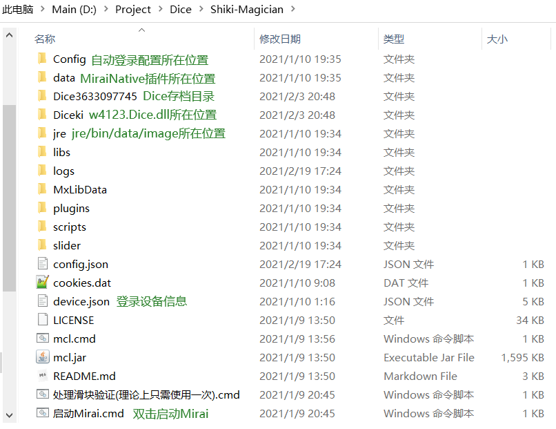
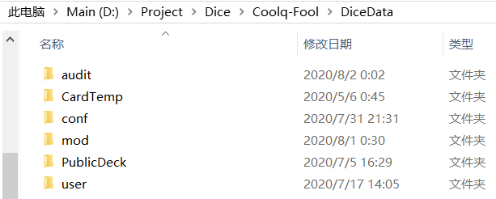
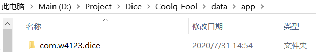
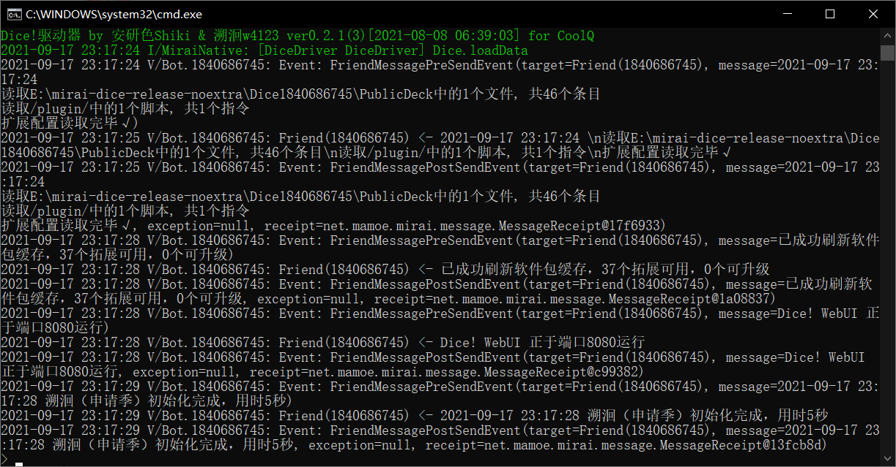
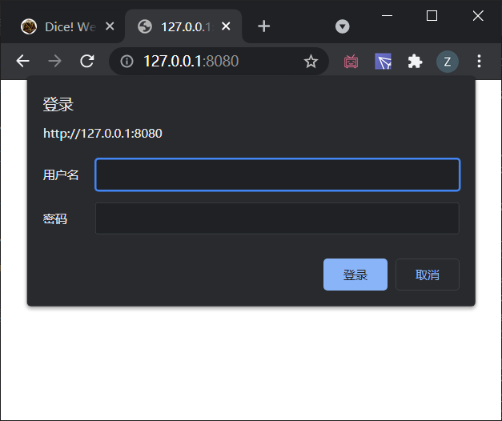
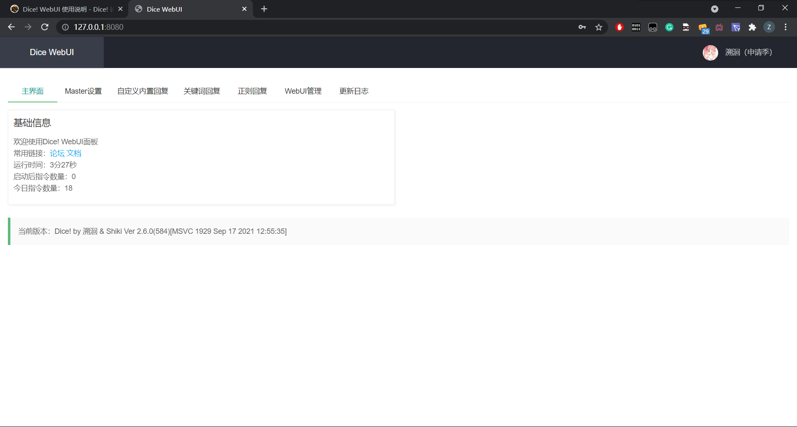
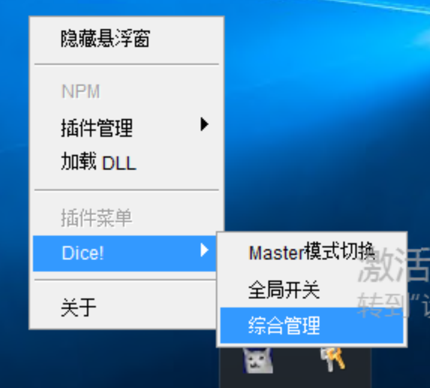
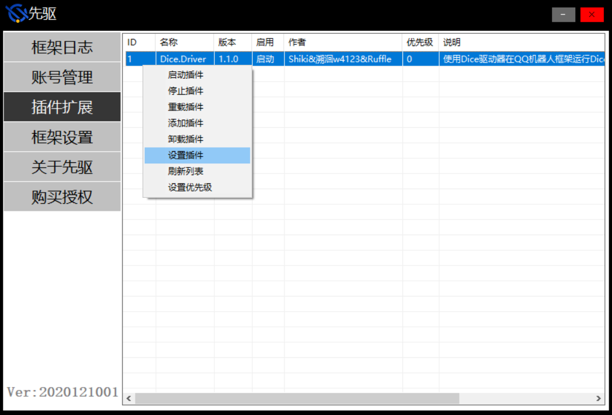
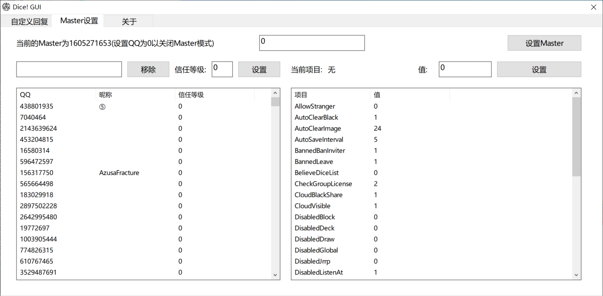
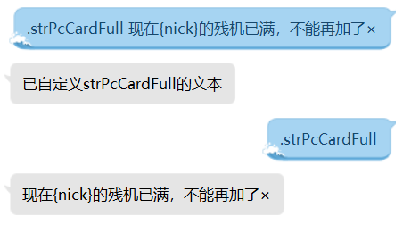

# Dice! Master手册

手册更新时间：20220607

*这是Dice!于2022.6.6更新2.6.4rc(612)后对应的[Master手册](https://v2docs.kokona.tech/zh/latest/Master_Manual.html)*。<br>
用户指令请参考[用户手册](https://v2docs.kokona.tech/zh/latest/User_Manual.html)。<br>
更多内容可参看[Dice!论坛](https://forum.kokona.tech/)。<br>
**本手册中[DiceData]一律指代Dice!存档目录，当前版本格式为[框架根目录]/Dice[DiceQQ]**

### 前言

**感谢您选择Dice!**<br>
此手册将帮助您了解Dice!的基本使用和配置<br>
如果在使用中遇到任何问题或者有任何建议，请在阅读文档后访问[Dice!论坛](https://forum.kokona.tech/)提出你的想法<br>
如果你认为此文档中有任何错误或值得改进的地方，欢迎点击右上方 Edit on GitHub 按钮修改文档。或者你也可以在论坛提出你的想法<br>
祝跑团顺利！

### 目录

- [更新说明](#更新说明2.6.4)
  - [从2.5.0+版本升级](#从2.5.0+版本升级)
  - [从低版本升级到2.5.0+](#从低版本升级到2.5.0+)
- [框架说明](#QQ框架Dice!2.5.0+)
- [管理面板](#WebUI配置面板（推荐）)
- [控制台指令](#控制台指令)
- [全局配置](#全局配置)
- [用户策略](#用户策略)
- [云操作](#云操作)
- [不良记录](#不良记录)
- [个性化](#个性化)
	- [扩展指令](#扩展指令)
	- [自定义回复](#自定义回复(.reply))
	- [自定义回执文本](#自定义回执文本(.str))
- [支持作者](#支持作者)
- [常见问题](#常见问题)
	- [登录失败](#登录失败)
	- [账号屏蔽](#账号屏蔽)
	- [网络连接失败](#网络连接失败)
- [附录](#附录)
- [更新历史](#更新历史)
- [后记](#后记)

### 更新说明2.6.4

- WebUI优化回执跨行编辑，同步reply的触发词多对一
- 新增`.mod on/off/list`指令
- mod新增event子目录，支持循环`cycle`/定时`clock`/代理`hook`类型事件
- 更新log指令，允许自定义log名
- 更新ob指令
- 新增`.link state/list`

#### 更新说明(2.6.3)

- 新增DisableStrangerChat禁用非好友私聊
- lua允许向msg读写成员，支持`msg:echo`方法
- 扩展[mod](#扩展模块mod)目录结构，支持reply/script/speech子文件夹
- 优化[文本转义]()，支持花括号多层嵌套，支持{vary:uid?}对用户差分
- 优化[关键词回复](#自定义回复(.reply))的解析，支持一个回复对应多个关键词，指令设置时以 **|** 为分隔符
- http.post支持定义contentType
- 修复.sc使用给定理智值时，剩余理智存入角色卡的bug
- 修复[敏感词检测](#自定义敏感词库(.admin censor))时点（点号开头、指令、回复、被at时）

#### 更新说明(2.6.2)

- 可使用[.str reset](#自定义回执文本(.str))指令重置过时的文本而无需重启了
- reply新增[触发限制条件](#触发条件)，`reply set`时可加入Limit字段
- 优化.setcoc指令，可使用.setcoc show查看
- getUserConf支持获取用户名称
- getGroupConf支持获取群名片/群权限/最后发言
- WebUI页面为Master配置项添加说明
- 角色卡、用户配置、群配置支持读写table
- lua新增函数log，用于向框架或通知窗口输出日志
- 允许设置全局默认rc房规
- 允许lua修改5级以下信任

#### 更新说明(2.6.1)

- lua新增http.get/http.post等函数
- 对lua优化require路径，现在require可以读取Diceki/lua/文件夹下的lua或dll了
- [CustomMsg](#自定义回执文本(.str))不再兼容远古版本的序号转义（形如{0}{1}），请手动调整
- 新增.bot信息抬头strBotHeader，请自定义（默认发布版写作"标准型"，测试版写作"试作型"）
- [自定义回复](#)新增前缀匹配模式
- 新增.ak指令
- WebUI提供reply跨行编辑按钮

#### 更新说明(2.6.0)

- ww指令机制优化
- 支持[reply](#自定义回复(.reply))使用多种触发模式与回复模式
- 可使用[WebUI](#WebUI配置面板)进行远程图形化配置，原设置插件/综合管理重定向至WebUI
- .pc stat角色卡掷骰统计

#### 更新说明(2.5.2)

- 支持[自定义文本](#自定义文本转义)使用sample转义多选一
- [自动清理过期用户数据](#过期数据自动清理(.admin InactiveUserLine/InactiveGroupLine=360))（默认360天）
- 高频指令通知将显示最后一次指令的内容
- 增加入群后对[同系Dice!的识别](#本系骰识别)
- 降低jrrp失败向后台报错的频率
- 修复单次清群上限无作用的bug
- 修复st格式错误导致CPU100%的恶性bug
- 修复了一些其他bug

#### 更新说明(2.5.1)

- 优化{pc}丢失、群昵称获取失败等问题
- 扩展通知窗口级别，允许.send notice
- 允许自定义定时任务
- 优化lua跨平台编码问题
- lua预设函数新增到18个

#### 更新说明(2.5.0)

- 允许安装lua脚本指令
- 本体独立于框架，必须由Dice驱动器装载
- 使用`.admin ListenSelfEcho/ListenGroupEcho`自定义是否接收自己的私聊/群聊消息
- 补充了对自身的指令频度监控，避免自我响应
- 使用`.admin GroupInvalidSize`自定义协议无效的群规模
- 开启对同系Dice的识别
- 缓存今日人品，允许lua调用
- 默认自动保存间隔调整为5分钟

### QQ框架(Dice!2.5.0+)

2.5.0版本，Dice!本体由酷Q插件改为了独立于框架的dll，由作为框架插件的DiceDriver加载，具体能实现的接口视框架条件而不同。先驱跑路后，Dice!驱动器目前支持Mirai、MyQQ、MyQQA、OnoQQAir、go-cqhttp框架，也在跟进OvQQ等更新。由于不同版本适配进度不同，你可能无法找到以下所有版本。*Miria加载DiceDriver须使用MiraiNative插件。*

#### QQ登录协议

同一QQ在同一类型设备（手Q/电脑/平板）登录时会将原先设备挤占下线，因此骰娘在框架登录所用设备应与人工登录所用设备错开。

#### 选择一个框架

MiraiAndroid是当前不使用模拟器在**手机挂载Dice**的唯一选择，MiraiDice也支持在Linux、MacOS等系统挂载Dice，详见[Dice! 论坛 Mirai版教程](https://forum.kokona.tech/d/448-mirai-dice-20210324)。

##### 框架接口差异

- Mirai2.x（MiraiNative转接）：
  1. 支持手Q/平板登录
  2. 不能多开QQ，启动即登录
  3. 无法处理登录设备异常（但支持设备锁验证）
  4. 平板登录无法正确识别部分登录失败原因（当前版本过低）
  5. 不能响应来自自己的消息
  6. 无法获取未加入群的群信息
  7. **支持Windows, Linux, MacOS, Android**, iOS(停更中)
  8. 不依赖中心服务器，**不存在框架后台服务器跑路或连接失败**

- MyQQ：
  1. 由于程序不支持附加调试，存在未排除的异常风险
  2. 固定PC设备登录，协议可以选PC版QQ或者PC版TIM等
  3. 允许多开QQ，支持扫码登录
  4. 因为程序缺陷，会出现连接服务器失败、“与服务器北京时间相差超过1秒”等问题
  4. 无法私聊发送语音文件
- MyQQA（MQ安卓版）：
  1. 由于程序不支持附加调试，存在未排除的异常风险
  2. 支持手Q/平板登录
  3. 允许多开QQ，但不支持启动自动登录
  4. 选择手表协议登录时支持扫码登录
  5. 接收好友申请时无法获取验证信息
  6. 因为程序缺陷，会出现连接服务器失败、“与服务器北京时间相差超过1秒”等问题
  7. 能接收频道消息，但发送频道消息疑似需要申请官方接口
- OnoQQ-Air（免费版）：
  1. 作为单Q阉割版存在登录重复弹窗等缺陷
  2. 固定PC设备登录
  3. 不能多开QQ，支持扫码登录
- go-cqhttp：
  1. **最高的账号或风控概率**
  2. 支持手Q/平板/手表登录
  3. 不能多开QQ，但DiceDriver支持一键启动多个go-cqhttp.exe
  4. 支持扫码登录

#### 框架目录结构

**Mirai目录**

非Windows系统可能目录稍微不一致，但文档中提到的应该适用于任何操作系统。Android版目录位置为内部存储空间/Android/data/io.github.mzdluo123.mirai.android/files/

#### 2.5.0+版本升级

- 先驱版本: 需要将更新版的w4123.Dice.dll放入Diceki文件夹替换旧文件，并重载DiceDriver插件；如果DiceDriver同时有新版则必须同步更新
- Mirai版本：执行Update.sh/更新.cmd
- MiraiAndroid: 安装新版APK
- 请关注论坛以获得具体版本的更新方法

#### 从低版本升级到2.5.0+

##### 迁移骰娘存档到整合包

将对应版本的存档目录[DiceData]复制到新框架根目录下。

- 原Dice2.4.0及以上版本：根目录下的Dice[DiceQQ]文件夹
- 原Dice2.3.8exp9及以上版本酷Q骰娘：根目录下的DiceData文件夹

如为原Dice2.3.8exp10(555)及以下版本：将data/app/com.w4123.dice复制到新目录[DiceData]/com.w4123.dice的位置。

##### Mirai框架升级

1. 按照论坛中教程，使用新安装方法安装新版本Mirai
2. 迁移Dice[DiceQQ]目录
3. 将根目录下device.json复制到根目录下（让Mirai继续使用先前的登录信息）

### WebUI配置面板（推荐）

WebUI是**全平台**可用的图形化配置页面，通过Dice!初始化时运行的监听端口访问。

#### WebUI 基础使用

在登录成功以后，Dice!会向Master(没有Master的情况下，自己) 发送WebUI运行的端口。如图中运行在8080端口。默认情况下，WebUI运行在一个随机的未使用的端口，但你可以通过WebUIPort属性更改。



在本地(运行Dice的同一个设备)浏览器中输入`http://127.0.0.1:端口`进入WebUI **请一定要输入http://否则某些浏览器会卡死** <br>`.system gui`指令也会**引导打开WebUI**<br>如果你在远程访问WebUI，请确定已配置好防火墙等，并使用对应的IP地址或域名访问（而不是127.0.0.1）


提示登录时，默认用户名为admin，密码为password，进入WebUI后可在WebUI配置栏更改密码。WebUI默认只允许本地访问，所以如果设备只有你一个人能访问（不是共享的云服务器等）不更改密码也无所谓。


可以在上面执行管理操作，应该都符合直觉。需要注意的是你可以直接点击表格修改其中内容，表格中的修改无需点击保存等，会在编辑完成后自动生效。

#### WebUI 配置

WebUI有三个配置项，更改配置后重启才会生效<br>
`EnableWebUI` - 启用WebUI, 0为禁用, 1为启用, 默认为1<br>
`WebUIPort` - WebUI端口, 0为随机, 其他为固定端口<br>
`WebUIAllowInternetAccess` - 允许从非本地地址访问WebUI, 0为不允许, 1为允许, 默认为0, 也就是WebUI默认只能从本地访问。如果你使用Docker网络等，你可能需要将此项设置为1才能在Docker宿主机上访问WebUI。

#### WebUI 环境变量

可以通过环境变量设置WebUI配置。环境变量具有较高优先级。<br>
`DICE_WEBUI_PORT` 设置端口，0为随机端口<br>
`DICE_WEBUI_PORT_USE_VARIABLE` 使用另一个环境变量的值作为端口，比DICE_WEBUI_PORT有更高优先级，可用于PaaS等平台<br>
`DICE_WEBUI_ALLOW_INTERNET_ACCESS` 0为不允许, 1为允许

#### 配置远程访问

WebUI 使用 HTTP Digest验证，密码保存为Digest，理论上比较安全。然而，如果需要暴露到公网，我们仍然推荐使用nginx或apache等配置好TLS然后反向代理到Dice WebUI以确保安全。<br>
**当然，允许远程访问前请务必更改密码，不然再安全也没用。**

### GUI管理面板（已停更）

**任意Windows框架**可对骰娘发送`.system gui`打开图形界面（确认进入GUI，取消进入WebUI）。请注意此页面将不会继续更新并有可能在未来版本移除，推荐使用上方提到的WebUI进行设置修改。

(MiraiNative)右键**托盘图标（流泪猫猫头）->（插件菜单）Dice!->综合管理**

(先驱)**插件扩展->Dice.Driver(右键)->设置插件。单框架多开时请使用指令，避免错乱**

可在界面内设置Master、调整用户信任、修改CustomMsg文本、修改全局配置



### Master模式

Master是骰娘的控制者，每个骰娘同时至多只能有一个Master。Master可以控制骰娘的发言和行为，并个性化大量配置。受信任用户也可以获得对骰娘的部分权限，但只有Master拥有发放和回收高级权限的权限。

Master功能初始默认关闭，你可以在WebUI/GUI管理面板完成认主（推荐，WebUI支持全平台）。对于Mirai纯命令行环境，如果无法访问WebUI及GUI，需要在Mirai命令行发送`npm menu <ID> eventMasterMode`（无其他插件时ID一般为0，指令即为`npm menu 0 eventMasterMode`）。

#### Master绑定/解绑

Master模式初次开启后为无主状态，此时对骰娘QQ发送`.master (private/public)` 将绑定发送者QQ为Master。也可直接在管理面板设置Master。认主时将自动开启全类型通知窗口，**建议将部分通知特别是通知窗口0转移到专门的小群**。<br>
`.master (private)` 默认**私骰作成**，将自动开启私用模式<br>
`.master public` **公骰作成**，将骰娘初始化为公骰，自动调整相应的配置<br>
`.master delete` 解除绑定，骰娘此时会重回无主状态，清空通知窗口，但先前设定的配置不会初始化。<br>
`.master reset [新masterQQ]` 解除绑定，骰娘此时会认主[新masterQQ]（原Master保留信任级别）<br>
`.master admin`添加管理时自动将私聊添加为监视窗口，管理可以用`.admin delete`放弃权限，清除窗口可以私聊`.admin notice - me`

### 控制台指令

#### 状态查看

`.admin state` 可以查看当前的全局设置和黑白名单情况

#### 遥控开关

- `.admin boton/botoff [群号]` //等效于所在群群管使用.bot on/off <br>
- `.dismiss [群号]` //可以遥控骰娘退出所在的群，即使骰娘不在，也能将该群移出白名单 

#### 消息发送(.send)

send用于用户与管理员间的远程交流<br>
`.send 待发送消息` （任何人可用）向Master发送消息<br>
`.send [窗口] [待发送消息]` //向指定窗口发送消息（权限4限定；**权限5用户发送的消息不会标明转发来源，等效于骰娘亲自说话**)

**窗口**是指QQ收发消息的聊天窗口。窗口参数识别一下6种格式:

- qq [QQ号]
- group [群号]
- discuss [讨论组号]
- notice [通知类型]（仅send可用）
- this（发送指令的窗口）
- me（发送者的私聊窗口）

#### 消息转发(.link)

link用于管理员与特定窗口保持交流（尤其是新加入、待审核的群），或者操纵骰娘跑团  <br>
`.link to/from/with [窗口]` 当前窗口向目标窗口单向转发/单向接收/双向转发消息  <br>
`.link close` 关闭从当前聊天窗口发起的消息转发  <br>
`.link start` 开启上次建立的链接  <br>
**对象窗口为群/讨论组时，可省略group/discuss，直接输入群号；对象为私聊时，qq可简写为q**  <br>
**转发自Master的消息不会标明转发来源，等效于骰娘亲自说话**  <br>
**无法确认目标聊天窗口是否存在，可能会导致没有反应**

#### 系统指令(.system)

`.system save` //立即存储所有数据（相当于执行所有停用应用时的操作）  <br>
`.system load` //立即读取外置文件（模块、牌堆和角色卡模板）。便于不重载应用的反复调试。save/load涉及的文件见附录。  <br>
`.system state` //显示插件运行时间及内存占用等硬件信息<br>
`.system rexplorer` //杀死资源管理器后重启。当 Windows 服务器内存占用逐渐随时间而升高时，考虑由资源管理器逐渐占用内存导致，可能适用该指令。**权限5可用**。

#### 一键清群(.master groupclr)

遍历群列表并退出符合条件的群，**也可以在应用菜单中【一键清退】**。部分框架群列表上限500，**请避免群数超过500**。单次清群上限受`GroupClearLimit`调节（默认一次至多退20个群）。 <br>
`.master groupclr` 可以实现一键退群，无参数时默认参数为unpower  <br>
`.master groupclr [天数]` 将退出当前所有**骰娘在指定天数内未发言**的群  <br>
`.master groupclr unpower` 将退出当前所有**骰娘不是群管/群主**的群  <br>
`.master groupclr preserve` 将退出当前所有**无`许可使用`**的群  <br>
`.master groupclr black` 将退出当前所有**黑名单群**和**有危险的黑名单用户**的群

### 全局配置

配置项目表见[附录](#配置项目表)  <br>
`.admin [关键词]` //查看配置项状态，如.admin Private  <br>
`.admin [关键词]=[数值]` //修改配置项。一般的开关项1表示开启，0表示关闭

#### 通知窗口

运行过程中产生的提醒、警告等通知消息会分类型发送给设置的通知窗口。所有通知被分为0-9共十个等级，其中0-5会被骰娘用于内置广播，6-9用于自定义（具体通知类型见[附录](#通知类型表)）。当产生通知时，会向通知窗口中所有接收该类型通知的窗口发送消息。如果没有窗口能发送消息，骰娘会将通知发送给自己；无论如何所有通知会自动保存在"[DiceData]\audit"中，请定期整理该文件夹。 由于通知窗口0会产生较多日志型消息，**建议将通知窗口0转移到专门的小群**。 <br>
`.admin notice [窗口] +/-[通知类型](...+/-[通知类型])` //增减通知窗口类型  <br>
`.admin notice - [窗口]` //直接移除指定窗口。  <br>
`.send notice [通知类型] [通知文本]` //向指定类型窗口广播通知  

例:  <br>
`.admin notice group 928626681 -0-1-2-3-4+5` 变更通知类型的接收情况  <br>
`.admin notice - this` 直接移除当前通知窗口

#### 全局开关(.admin DisabledGlobal=0/1)

DisabledGlobal=1等价于.admin off（全局关闭）。开启时一切如常，关闭则进入静默状态，所有群聊/讨论组会相当于.bot off状态而无视群内设置，私聊会回复关闭中的信息。也可以用.admin on/off 操作全局开启/关闭，也可以在应用菜单中点击"全局开关"自动切换。

#### 定时点事件(.admin clock)

`.admin clock +/- [任务名] [时]:[分]`  添加/移除 定时任务  <br>
内置定时任务:on-全局开启;off-全局关闭;clear-黑名单清群  <br>
允许调用自定义任务，参考plugin手册  <br>
每日执行，如果当日错过不会补回。  <br>
定时开启和定时关闭时会向窗口4发送通知文本  <br>
清群为基于黑名单清群(=.master groupclr black)

#### 定时长事件

以下事件会在Dice!每运行固定时间后执行一次  <br>
`.admin AutoSaveInterval=5` //定时保存用户数据(min)，默认每5分钟保存一次  <br>
`.admin AutoRemake=0` //定时重启(h)，默认关闭。  <br>
**定时系统监测报警**(.admin SystemAlarmRAM/SystemAlarmCPU/SystemAlarmDisk=90) ：每半小时监测一次系统内存、CPU、硬盘占用(%)，超过阈值即报警。报警状态下每5分钟监测一次，如果数值升高超过1个百分点则继续报警，低于阈值则会提醒解除报警。设置在1-99时生效。


### 用户策略

#### 用户记录(.user)

用户在使用指令或被授予信任后会生成用户记录  <br>
`.user state` //查看自己用户记录  <br>
`.user trust [用户qq]` //查看用户信任级别（4以上限定，上级对下级屏蔽）  <br>
`.user trust [用户qq] [信任级别]` //调整用户信任级别（4以上限定，只能调整下级用户，最高为255）  <br>
`.user diss [用户qq]` //最轻的拉黑用户(type=local,danger=1)

##### 用户授信(.user trust)

每名登记用户会标记信任级别，初始为0。级别越高享受的权限越多，上级包含下级的所有权限。

`.admin whiteqq (-) [白名单QQ]` 可以为用户授予信任1(带减号为收回信任)

```eval_rst
+-------------------+--------------------------------------------------+
| 信任级别          | 权限                                             |
+===================+==================================================+
| 1（原用户白名单） | 为群分发使用许可，允许使用某些指令               |
+-------------------+--------------------------------------------------+
| 2                 | 黑名单豁免                                       |
+-------------------+--------------------------------------------------+
| 3                 | 响应退群指令，接受不良记录共享(warning)          |
+-------------------+--------------------------------------------------+
| 4（原管理）       | 查看、分发和收回低于4的用户权限，原管理权限      |
+-------------------+--------------------------------------------------+
| 5及以上           | 查看、分发和收回低于自身的用户权限，系统操作指令 |
+-------------------+--------------------------------------------------+
```

#### 过期数据自动清理(.admin InactiveUserLine/InactiveGroupLine=360)

最后活跃天数超过InactiveUserLine的用户，其记录及角色卡会在清理用户时被清除；最后活跃天数超过InactiveGroupLine的群，其记录及开团信息会在清群时被清除。（配置项为0时不生效）

清理过期数据会在定时任务`clear`中自动执行，在执行清群时也会在退群的同时检测目标群是否会被清理。

#### 监听好友申请(.admin ListenFriendRequest=1)

默认开启，仅好友验证方式为【需要验证信息】或【需要回答问题并由我确认】时有效，拦截消息并决定通过或拒绝。黑名单用户必定拒绝。同意好友邀请时将发送strAddFriend，特别地，通过受信任用户的好友时会发送strAddFriendWhiteQQ。当好友验证方式为【允许任何人】或【需要正确回答问题】时，通过开启**ListenFriendAdd**，也会向通过的好友发送strAddFriend，注意这种方式通过的好友可能仅为单向好友。

#### 允许陌生好友邀请(.admin AllowStranger=0/1/2)

默认为1。决定是否接受陌生人的好友邀请：2-无条件接受;1-无用户记录不接受;0-无信任不接受。该项设定建议配合QQ自带的【允许陌生人邀请我加入群聊】选项。

#### 单群设置(.group)

`.group ([群号])+/-[词条]` //修改单群设置，群内原地使用可省略群号

```eval_rst
+----------------------------------------------------+--------------------------------------------------+------------+
| 词条                                               | 作用                                             | 修改要求   |
+====================================================+==================================================+============+
| 许可使用                                           | 私用模式/审核模式可正常邀请入群/群内使用         | 信任1      |
+----------------------------------------------------+--------------------------------------------------+------------+
| 未审核                                             | 审核模式下标记新加入无【许可使用】的群，拒绝指令 | 信任1      |
+----------------------------------------------------+--------------------------------------------------+------------+
| 免清                                               | 清群时和搜查黑名单时略过该群                     | 信任2      |
+----------------------------------------------------+--------------------------------------------------+------------+
| 免黑                                               | 发生在该群的不良记录无效；不搜查黑名单           | 信任4      |
+----------------------------------------------------+--------------------------------------------------+------------+
| 忽略                                               | 不接受任何该群的事件                             | 信任4      |
+----------------------------------------------------+--------------------------------------------------+------------+
| 协议无效                                           | 不接受除云黑外的事件                             | 信任4      |
+----------------------------------------------------+--------------------------------------------------+------------+
| 停用指令                                           | 停止响应指令和'.'开头的回复（即.bot off）        | 信任或群管 |
+----------------------------------------------------+--------------------------------------------------+------------+
| 禁用回复                                           | 停止响应自定义回复                               | 信任或群管 |
+----------------------------------------------------+--------------------------------------------------+------------+
| 拦截消息                                           | 拦截消息，阻止低优先级插件响应                   | 信任或群管 |
+----------------------------------------------------+--------------------------------------------------+------------+
| | 禁用jrrp/禁用me/禁用ob                           | 禁用对应指令                                     | 信任或群管 |
| | /禁用draw/禁用help                               |                                                  |            |
+----------------------------------------------------+--------------------------------------------------+------------+
```

- *原群白名单自动初始化为【许可使用】+【免清】*
- *重要的大群（跑团交流群、骰娘群）请加【免清】+【免黑】或【忽略】，以免意料之外的自动退群*
- `.admin whitegroup` 查看当前【许可使用】或【免清】或【免黑】的群列表

##### 授权许可(!authorize)

受信任用户可通过在群内发送!authorize或在任意窗口发送!authorize +[群号]来为目标群添加【许可使用】。非信任用户也可在群内使用!authorize [理由]向窗口2发送许可申请。<br>
`!authorize (+[群号])` //受信任用户为本群+许可使用 <br>
`!authorize (+[群号]) [理由]`  //非信任用户申请本群许可 <br>
撤销许可使用需要使用`.group [群号] -许可使用`

#### 批量群处理(.groups)

取群列表.groups list(管理限定)<br>
.groups list idle //按闲置天数降序列出群<br>
.groups list size //按群规模降序列出群<br>
.groups list [群管词条] //列出带有词条的群

#### 监听群邀请(.admin ListenGroupRequest=1)

默认开启。接收用户的群邀请（**小群邀请**将由QQ系统自动通过，因此骰娘无法处理或知晓邀请人），拒绝来自黑名单的邀请，邀请来自受信任用户时通过且自动为群添加【许可使用】，非信任用户时私用模式而定。通过邀请的同时标记邀请人。**如果回执为【已同意】却实际并未入群，考虑接口出错或腾讯屏蔽。**

#### 入群检测(.admin ListenGroupAdd=1)

默认开启。入群时反馈群信息（群名、群号、群人数、邀请人），遍历群员，获取群主信息（临时创建的群可能无法获取群管理信息）、检索黑名单，为私用模式二次确认【许可使用】，为审核模式检查【许可使用】；群内发现黑名单时会通知，有管理员是黑名单时会触发退群（群未设置【免清】或【免黑】时）。发送strAddGroup。

#### 私用模式(.admin Private=1)

认主时私骰作成进入私用模式，仅在**受信任**用户或【许可使用】群邀请时接受邀请，在**新加入管理员无信任用户**（否则为群自动添加【许可使用】）且**无【许可使用】的群**时自动退出，退出时自动留言。也可以用`.admin only/public` 切换私用/公用状态。

#### 审核模式(.admin CheckGroupLicense=0/1/2)

入群后，对于无【许可使用】的群，将自动标记【未审核】并发送strAddGroupNoLicense。该项生效时将拒绝提供除help之外的其他服务，其余指令仅authorize/dismiss/bot有效。该项为1时拒绝所有【未审核】的群（不溯及审核模式开启前已加入的群），该项为2时拒绝所有无【许可使用】的群（含开启前已加入的群）。

**审核模式与私用模式的差别**：

- 审核模式会在未许可群停留，增加潜在风险
- 留在群内有更高向用户群引流的概率
- 由于自动入群的小群无法正常给群加【许可使用】，骰娘在无法识别群管理的情况下会自动退群，需要受信任用户额外使用一次!authorize [群号]，重复邀请

#### 自动退出讨论组(.admin LeaveDiscuss=1)

开启**LeaveDiscuss**后，只要讨论组有人发言，就会自动退出讨论组。但开启后始终无人发言的讨论组无法处理，只能手动处理。*讨论组具有许多不适应QQ框架的机制，如无法获取讨论组列表，无法获取邀请信息，无法获取成员列表，无法自动检测被踢。*

#### 黑名单(.admin blackqq/blackgroup)

任何情况下，来自黑名单的邀请不会被通过，指令除了dismiss都不会被响应<br>
`.admin blackgroup (-) ([黑名单理由]) [黑名单群号]` 可以添加群黑名单(带减号是删除)<br>
`.admin blackqq (-) ([黑名单理由]) [黑名单QQ]` 可以添加用户黑名单(带减号是删除)，带理由时危险等级为2且通知对方，否则危险等级为1。<br>
`.admin blackfriend` //查看好友列表内的黑名单用户<br>
**危险**的黑名单用户包括**群内权限更高**的用户或**非免清群内相同权限用户（可选）**，同时危险等级需要达到2。危险等级只有1的黑名单用户不通知、不会触发退群。<br>
*现在自己、Master、信任2以上用户都不会新加入黑名单。*

#### 不良行为检测(.admin ListenGroupKick/ListenGroupBan/ListenSpam=1)

默认开启。分别开启后，移出、禁言、刷屏会被加入黑名单。生成危险等级2的不良记录后，会自动向通知5窗口广播生成的!warning指令。**warning指令**：接收到信任3或记录可识别的骰娘warning时，骰娘将自动录入黑名单。骰娘通过这一机制实现不良记录的传递共享。<br>
拉黑群时会自动移除【许可使用】。<br>
*刷屏在程序内定义为发送指令超过20/30s，实际解释权归Master所有*

#### 邀请人连带(.admin KickedBanInviter/BannedBanInviter=1)

默认开启。被移出/禁言时将入群邀请者同时加入黑名单。<br>
*邀请者责任源于协议中不得擅自拉群的规定，这里的擅自是双向的：一边无视骰娘协议，一边无视群内意愿*

### 云操作(.cloud)

#### 查看更新(.cloud update)

注意：此功能可能暂时不可用。对于Mirai请执行更新.cmd或Update.sh以进行更新。<br>
远程获取Dice!正式版及开发版信息<br>
`.cloud update` //检查版本更新<br>
`.cloud update release` //下载最新发布版<br>
`.cloud update dev` //下载最新开发版（使用测试版/开发版请保持与开发者的交流）

#### 同步不良记录(.cloud black)

该指令会从后台获取经核验的不良记录，并更新本地黑名单库。骰娘不会自动同步云端记录。

### 不良记录

#### 不良记录上传(.admin CloudBlackShare=1)

**该选项默认开启** <br>
开启时，当骰娘原生生成Kick/Ban/Spam记录时，会同时向后台发送该记录。记录在后台收录后处于待核验状态，需要后台管理二次核验才会对其他骰娘生效。<br>
所有云记录有唯一的wid。*上传可能因连接后台失败而失败* 对于生成记录过于频繁，或不良记录源于非Dice!原因与用户产生不良互动的，后台会拒绝收录该骰娘的记录。

“**同步云不良记录同步失败**”的处理方式：手动访问url指向的网页，本地另存为后，参考下文【读取外源记录文件】的方式手动读取。

**该选项开启时，其他QQ发送云端已核验的记录也会对该骰娘生效。**

#### 读取外源记录文件

将其他来源的不良记录BlackList.json重命名为BlackListEx.json，放置于\[DiceData]/conf目录下。Dice!加载时会自动读取并更新记录，之后该文件会被销毁。两种情况下已有记录不会在读取时更新：DiceMaid就是自己；危险等级与本地记录不同。

#### 云记录注销

当前记录核销在群(928626681)内完成，入群后可使用以下指令：<br>

- isbanqq=[qq] 查询目标QQ的云记录
- 查询wid=[wid] 获取wid对应的记录
- erase=[wid] 注销wid对应的记录，仅记录中的当事骰娘(DiceMaid)和骰主(masterQQ)可用

可私聊司令塔Bot`Shiki(Pope)(530136753)`（具体角色可能会有变动）进行上述操作。也可请求管理来完成注销，最通用证明材料为：当事人对当事骰娘发送.admin isban [本人QQ]，连同骰娘回复将聊天记录转发给管理。

#### 用户自行解黑

云记录核销之后，所有骰娘并不会自动同步。遇到尚未注销黑名单的骰娘，请用户自行解黑。方法为**对已注销的骰娘发送.admin isban [QQ]**，将得到的warning指令保存，用于私聊未注销的骰娘。由于骰娘存在连接后台失败的可能，导致无法获取记录更新的信息，因此无法保证指令有效。这时请联系相应骰主。

### 其他机制

#### 框架消息富文本转义（CQ码）

DiceDriver会将不同框架下接收的QQ富文本消息（图片、语音等）转换为统一的CQ码，发送时则会转义回框架格式

`[CQ:image,file=xxx.abc]` 将本地`[框架根目录]/data/image/xxx.abc`位置的图片上传并在消息中发送

`[CQ:image,id=xxx]`接收消息中的图片，id与服务器缓存图片对应，但区分群聊图片与私聊图片。群聊调用私聊消息的图片id将无法正常发送图片，反之同理。

`[CQ:record,file=xxx.silk]`将本地`[框架根目录]/data/record/xxx.silk`位置的语音上传并覆盖整条消息内容发送（Mirai不限制文件后缀）

`[CQ:face,id=xxx]` 发送对应id的QQ黄豆表情

`[CQ:emoji,id=xxx]` 发送对应十进制编码的Unicode字符

#### 消息送间隔(.admin SendIntervalIdle=500)

一般地，Dice!的待发送QQ消息不会立即发送，而是进入发送队列排队发送，并在每次发送后等待固定时间，即发送间隔(ms)。`SendIntervalIdle`控制闲时发送间隔，`SendIntervalBusy`控制忙时发送间隔。

特别地，Dice!识别一条待发送消息中的分页符(`'\f'`)，并沿分页符将消息拆成多条，依序送入消息发送队列。分页符无法在指令输入时直接录入，可以输入{FormFeed}作为消息分段，调用时会自动转义。

#### 本系骰识别

Dice2.5.0+可以通过调用后台接口以识别目标QQ是否在Dice!云端有登记信息。新入群遍历群成员时将统计可识别本系骰数量。由于禁言反制和踢出反制是Dice!的默认协议，让Dice!骰去禁言/踢出另一只Dice!骰无疑是愚蠢的，因此在执行group ban/kick前会先查询目标是否为Dice!骰，是则不会进行实际操作。基于骰主所拥有的隐私权，云端不可见(CloudVisible=0)的Dice!骰不会被识别。

### 个性化

#### 自定义文本转义

回复文本中可以通过特定的{}标记转义文本，当前花括号支持嵌套。

指令回复中对用户（消息来源QQ）的通用转义如下：

- `{at}`-at用户QQ。
- `{nick}`-取用户昵称，优先级为群内nn>全局nn>群名片>QQ昵称。
- `{pc}`-取用户角色名，未录入角色卡则同{nick}。

部分转义方法：

- `{help:条目名}`-获取帮助文档指定条目。
- `{sample:分项1|分项2(...|分项n)}`-从所有分项中随机均匀抽取一项插入文本。例：` {sample:效果拔群|干得漂亮}`
- `{vary:uid?账号1=1号专属文本&账号2=2号专属文本&else=通用文本}`-根据消息来源差分回复

#### 扩展模块mod

扩展模块放入[DiceData]/mod/读取，可加载自定义回执、自定义回复与帮助词条，详见开发手册。

#### 扩展指令

扩展脚本可放入[DiceData]/plugin/读取。文件样例见附录，更多内容请参阅[脚本手册]()。默认可使用`.help扩展指令` 查询载入的指令。

#### 自定义帮助词条(.helpdoc)

`.helpdoc [词条名] [词条内容]` —— 自定义帮助词条<br>
词条内容以&开头表示重定向，如`.helpdoc 追仙子 &追仙`后，.help追仙子 将重定向到追仙的词条<br>
词条名**不需要是源代码中已有的**，请随意添加

特别地，部分词条会存在引用的情况，自定义时可以只自定义被引用的词条。
```json
{
    "设定":"Master：{master_ID}\n好友申请：需要使用记录\n入群邀请：黑名单制，非黑即入\n讨论组使用：允许\n移出反制：拉黑群和操作者\n禁言反制：默认拉黑群和群主\n刷屏反制：警告\n邀请人责任：有限连带\n窥屏可能：{窥屏可能}\n其他插件：{其他插件}{姐妹骰}\n骰娘用户群:{骰娘用户群}\n私骰分享群：863062599 192499947\n开发交流群：1029435374",
    "骰娘用户群":"【未设置】",
    "窥屏可能":"有",
    "其他插件":"【未设置】"
}
```

#### 自定义回复(.reply)

未视为指令而响应的消息，将按完全匹配->前缀匹配->模糊匹配->正则匹配的顺序检测触发词。**触发回复也会算入刷屏计数！**<br>
```
.reply set (Type=[回复性质](Reply/Order)) 
[匹配模式](Match/Search/Prefix/Regex)=[触发词1|触发词2]
(Limit=[触发限制])
[回复模式](Deck/Text/Lua)=[回复词]
```

- 回复性质：决定该回复由`停用指令`(bot off)还是`禁用回复`(reply off)控制开关。该项可省略，默认由reply控制。
- 匹配模式：Match-完全匹配；Prefix-前缀匹配；Search-模糊匹配；Regex-正则匹配。
- 触发限制：可填入零至多项触发条件，多项条件以`;`分隔，在触发词匹配后检查是否会被触发（**一项不满足就不触发**）。不触发的消息**不计入刷屏、不进入当日计数、不进入冷却计时**。
- 回复模式：Deck-牌堆（回复词以分隔符'|'切割为牌堆）Text-直接返回回复词；Lua-将回复词作为Lua语句执行，将返回值回复。

`.reply show [触发词]` 查看回复注释<br>
`.reply get [触发词]` 查看回复本文<br>
`.reply del [触发词]` 清除触发词<br>
`.reply list` 列出全部触发词<br>

默认可使用`.help回复列表` 查询触发词，帮助文档对所有人可见，建议手动修饰。

##### 触发条件

- 用户名单user_id：

  - 正向名单`user_id:`：只有所列ID中的用户才触发，ID以|分隔
    `user_id:触发用户1|触发用户2|...`
  - 反向名单`user_id:!`：只有所列ID中的用户不触发，ID以|分隔
    `user_id:!触发用户1|触发用户2|...`

- 群聊名单grp_id：

  **所有私聊的id视为0**，写入正向名单表示不限制私聊，写入反向名单表示私聊不触发

  - 正向名单`grp_id:`：只有所列ID中的群聊才触发，ID以|分隔，
    `grp_id:触发群号1|触发群号2|...`
  - 反向名单`grp_id:!`：只有所列ID中的群聊不触发，ID以|分隔
    `grp_id:!触发群号1|触发群号2|...`

- 触发概率prob：百分比概率触发
  `prob:概率`

- 冷却计时cd：计时器中有一个正在冷却状态则不触发，若触发则为每个计时器增加冷却时间。每个计时器以`&`分隔，计时器名称为空时默认取回复关键词。

  计量单位：`chat`-以聊天窗口为单位；`user`-以用户为单位；`global`-全局共享

  `cd:[计时器名称]@[计量单位]=[冷却秒数]&...`

  `[计时器名称]`可省略，视为取本回复的关键词；`@[计量单位]`可省略，视为`@chat`。特别地，当两者均省略时，`cd:秒数`表示以聊天窗口为单位，为本回复独立计算特定秒数的冷却。

- 今日计数today：计数器中有一个达到上限则不触发，若触发则为每个计数器+1。每个计数器以`&`分隔，计时器名称为空时默认取回复关键词。

  `today:[计数器名称]@[计量单位]=[计数上限]&...`

  省略机制同cd。

- 用户阈值user_var：UserConf中变量为特定值或以上或以下触发，每项以&分隔，`字段=值`表示等于时触发，`字段=值+`表示大于等于时触发，`字段=值-`表示小于等于时触发。特别地，`trust`表示信任等级
  `user_var:[变量1]=[阈值1]&[变量2]=[阈值2]+&[变量3]=[阈值3]-`

- 群聊阈值grp_var：群聊时取GroupConf，格式同user_var，使用时推荐搭配`grp_id:!0`排除私聊

- 自身阈值self_var：取DiceMaid自身UserConf，格式同user_var

- 骰娘识别dicemaid：根据对方是否识别为Dice!骰娘判别是否触发，消息来源为自己时不作判别

  - 仅骰娘触发`dicemaid:only`
  - 骰娘不触发`dicemaid:off`

#### 自定义回执文本(.str)

将系统处理事件的回执替换为自定义文本<br>
`.[键值] [文本]` ——自定义骰娘的某项回执<br>`.[键值] reset` ——重置为原生文本<br>
`.[键值] NULL` ——自定义文本为空白<br>
`.[键值] show` ——查看自定义文本<br>

**如果没有设置，strSelfName和strSelfCall将预设为QQ昵称，并且{self}会自动替换为strSelfCall，前者用于自我展示，后者用于自称。强烈建议自定义strHlpMsg和strAddFriend、strAddGroup，向不熟悉的用户介绍私骰的特别之处（申请、使用须知）。**

例:
```
.strSelfName 测试姬 //入群等自我介绍场合使用
.strSelfCall 本骰娘 //回执中用作自称，{self}的重定向
.strBotOn {self}开始工作了
.strAddGroup Shiki(Judgement), Servant Ruler, 四季映姫·ヤマザナドゥ。来，细数你的罪孽吧
.strRollFumble 大失败 就像是见了阎王一样
.strNameSet 以后就称呼{old_nick}的名称为{new_nick}了
```



#### 自定义敏感词库(.admin censor)

敏感词设置.admin censor  <br>`.admin censor +([触发等级])=\[敏感词0](|[敏感词1]...)` //添加敏感词  <br>`
.admin censor -\[敏感词0](|[敏感词1]...)` //移除敏感词  <br>
例:`.admin censor +=nmsl` //将“nmsl”设置为Warning级  <br>`.admin censor +Danger=nn老公|nn主人` //将“nn老公”、“nn主人”设置为Danger级  <br>`
.admin censor -手枪` //移除敏感词“手枪”

##### 匹配机制

骰娘会模糊匹配指令标识符(.)开头的消息，并返回所含敏感词的最高触发等级  <br>
匹配过程自动跳过文本中的特殊符号和空格，且大小写不敏感  <br>
受信任用户会相应降低触发等级，信任4以上用户将不触发检测

##### 触发等级

*使用指令设置Ignore等级可以临时屏蔽词库中不该生效的词，对外置词库这一等级是无意义的*  <br>
Ignore //无视  <br>
Notice //仅在0级窗口通知  <br>
Caution //提醒用户，并在1级窗口提醒  <br>
Warning //【默认等级】警告用户，并在1级窗口提醒  <br>
Danger //警告用户且拒绝指令，并在3级窗口警告  <br>
*请避免为纯字母/数字的敏感词设置较高触发等级，这些字符存在误匹配图片码的可能性

##### 词库批量加载

load会读取存档目录中/conf/censor下所有文本文件  <br>
字符编码默认按GBK读取，若字符为UTF8，可在开头先起一行"#UTF8"  <br>
一词一行  <br>
触发等级默认为Warning，读取到"#[触发等级]"时，后续录入的词调整为响应等级，如"#Danger" <br>

**词库文件示例**：
以下内容表示以utf-8编码，读取4个敏感词 "nmsl":Warning,"nn老公":Danger,"nn主人":Danger,"sb":Notice

```txt
#UTF8
nmsl
#Danger
nn老公
nn主人
#Notice
sb
```

#### 外置牌堆

将牌堆文件放入[DiceData]/PublicDeck内并重启或load，即可使用牌堆内的条目。牌堆名以'_'开头时，无法直接使用draw命令抽取。

### 支持作者

溯洄正在为后续的开发计划众筹:[https://afdian.net/@suhuiw4123](https://afdian.net/@suhuiw4123)

[也欢迎在爱发电支持Shiki](https://afdian.net/@dice_shiki):https://afdian.net/@dice_shiki

也可以微信赞赏Shiki:

### 常见问题

#### 登录失败

- Mirai显示**当前版本过低**：平板QQ(HD)已停止更新，该协议下各类登录失败原因都会写作“当前版本过低”，实际原因可能是账号登录被tx判定有风险，可以选择更换Mirai的登录协议。 

框架登录通过的成功率：**扫码登录>短信验证登录>无验证登录**

#### 账号风控（屏蔽）

账号被QQ屏蔽最常见的特征有：群聊消息无法成功发送，但私聊消息可以；长文本消息无法成功发送，但短文本可以。

验证是否被屏蔽最直接的方式为查看框架日志，如有发送消息的记录但实际并没有，则可以断定被屏蔽。除此之外的快捷检测方式为在群内发送暗骰指令`.rh`，如果私聊能正常收到结果但群聊无回执，则高概率为被屏蔽。

当账号被屏蔽时，建议暂停工作，避免带病上班，同时将账号作为正常QQ使用（养号）。

#### 网络连接失败

- 心跳报告失败：心跳只是向后台发送骰娘当前状态，不影响骰娘运行 
- jrrp获取失败：访问境外jrrp服务器失败会向后台报错，但用户会正常收到回执，不影响使用
- log上传失败：访问境外log服务器失败，需要手动从\user\log\文件夹提取txt 
- 不良记录上传失败：无法生成云黑wid，可以在审判群内发warning申请补录

#### 磁盘空间占用增多

- Mirai一键脚本使用.git更新文件，会造成.git文件夹堆积，如无回退需要可以直接删除
- Dice目录下`user/log/`所存储的.log记录文件不会在log结束后销毁，需要手动清理

### 附录

#### 配置项目表
**注：Disabled是不可用的意思！**

```eval_rst
+---------------------+----------+------------------------------------------------------+
| 关键词              | 默认状态 | 说明                                                 |
+=====================+==========+======================================================+
| DisabledGlobal      | 0        | 全局静默，只响应dismiss和bot，私聊会说明             |
+---------------------+----------+------------------------------------------------------+
| DisabledBlock       | 0        | bot off时拦截消息，阻止低优先级插件响应              |
+---------------------+----------+------------------------------------------------------+
| DisabledListenAt    | 1        | 停用指令时可以通过at指名响应指令                     |
+---------------------+----------+------------------------------------------------------+
| DisabledMe          | 0        | 拒绝响应.me                                          |
+---------------------+----------+------------------------------------------------------+
| DisabledJrrp        | 0        | 拒绝响应.jrrp                                        |
+---------------------+----------+------------------------------------------------------+
| DisabledDeck        | 1        | 拒绝响应.deck                                        |
+---------------------+----------+------------------------------------------------------+
| DisabledDraw        | 0        | 拒绝响应.draw                                        |
+---------------------+----------+------------------------------------------------------+
| DisabledSend        | 0        | 拒绝响应.send                                        |
+---------------------+----------+------------------------------------------------------+
| Private             | 0        | 私用模式开启（私骰作成=1）                           |
+---------------------+----------+------------------------------------------------------+
| CheckGroupLicense   | 0        | 审核模式，入群后检查许可使用                         |
+---------------------+----------+------------------------------------------------------+
| LeaveDiscuss        | 0        | 检测到讨论组发言时自动退出                           |
+---------------------+----------+------------------------------------------------------+
| ListenGroupRequest  | 1        | 响应群添加请求                                       |
+---------------------+----------+------------------------------------------------------+
| ListenGroupAdd      | 1        | 响应入群反馈                                         |
+---------------------+----------+------------------------------------------------------+
| ListenFriendRequest | 1        | 响应好友添加请求                                     |
+---------------------+----------+------------------------------------------------------+
| ListenFriendAdd     | 1        | 响应好友添加反馈（由插件通过则不重复）               |
+---------------------+----------+------------------------------------------------------+
| AllowStranger       | 1        | 0=仅允许白名单;1=允许有记录用户;2-允许非黑名单申请   |
+---------------------+----------+------------------------------------------------------+
| ListenGroupKick     | 1        | 响应群移出事件                                       |
+---------------------+----------+------------------------------------------------------+
| ListenGroupBan      | 1        | 响应群禁言事件                                       |
+---------------------+----------+------------------------------------------------------+
| ListenSpam          | 1        | 响应刷屏监测                                         |
+---------------------+----------+------------------------------------------------------+
| LeaveBlackQQ        | 0        | 检测群权限相同的黑名单用户时自动退出（公骰作成=1）   |
+---------------------+----------+------------------------------------------------------+
| BannedLeave         | 0        | 被禁言后自动退群（公骰作成=1）                       |
+---------------------+----------+------------------------------------------------------+
| BannedBanInviter    | 0        | 被禁言后拉黑邀请者（公骰作成=1）                     |
+---------------------+----------+------------------------------------------------------+
| KickedBanInviter    | 0        | 被踢后拉黑邀请者（公骰作成=1）                       |
+---------------------+----------+------------------------------------------------------+
| GroupInvalidSize    | 500      | 默认协议无效群规模                                   |
+---------------------+----------+------------------------------------------------------+
| GroupClearLimit     | 20       | 单次清群上限                                         |
+---------------------+----------+------------------------------------------------------+
| BelieveDiceList     | 0        | 信任来自骰娘列表成员的warning（公骰作成=1）          |
+---------------------+----------+------------------------------------------------------+
| CloudVisible        | 1        | 允许通过骰娘网络公开骰娘的QQ和其他信息               |
+---------------------+----------+------------------------------------------------------+
| CloudBlackShare     | 1        | 调节是否与云端互通不良记录                           |
+---------------------+----------+------------------------------------------------------+
| SystemAlarmCPU      | 90       | 系统CPU占用触发报警的百分比阈值（0则不检测）         |
+---------------------+----------+------------------------------------------------------+
| SystemAlarmRAM      | 90       | 系统内存占用触发报警的百分比阈值（0则不检测）        |
+---------------------+----------+------------------------------------------------------+
| SendIntervalIdle    | 500      | 闲时消息队列处理一条消息发送的间隔(ms)               |
+---------------------+----------+------------------------------------------------------+
| SendIntervalBusy    | 100      | 忙时消息队列处理一条消息发送的间隔(ms)               |
+---------------------+----------+------------------------------------------------------+
| AutoSaveInterval    | 5        | 自动保存事件间隔(min)                                |
+---------------------+----------+------------------------------------------------------+
| AutoFrameRemake     | 0        | 自动重启框架间隔(h)                                  |
+---------------------+----------+------------------------------------------------------+
| InactiveUserLine    | 360      | 用户不活跃天数上限(Day)（0则不生效）                 |
+---------------------+----------+------------------------------------------------------+
| InactiveGroupLine   | 360      | 群聊不活跃天数上限(Day)（0则不生效）                 |
+---------------------+----------+------------------------------------------------------+
| ListenGroupEcho     | 0        | 开启群内消息自我接收                                 |
+---------------------+----------+------------------------------------------------------+
| ListenSelfEcho      | 0        | 开启私聊消息自我接收                                 |
+---------------------+----------+------------------------------------------------------+
```

**指令禁用对信任4以上用户无效**
*如果使用了容易刷屏又没有独立开关的回复插件，建议开启DisabledBlock并令Dice拥有更高优先级*
*对.me特别处理的理由是其在跑团中几乎零作用，却可以制造骰娘自己说话的假象，引发风险。*

#### 通知类型表

```eval_rst
+-----------------------+--------------+----------+
| 事件                  | 554输出      | 通知类型 |
+=======================+==============+==========+
| 启动初始化            | 发送recorder | 0        |
+-----------------------+--------------+----------+
| 自定义回执文本        | 发送recorder | 0        |
+-----------------------+--------------+----------+
| 接收响应的warning     | 发送recorder | 0        |
+-----------------------+--------------+----------+
| 非黑受邀入群          | 发送recorder | 0        |
+-----------------------+--------------+----------+
| 非黑好友申请          | 发送recorder | 0        |
+-----------------------+--------------+----------+
| 刷屏初次提醒          | 发送recorder | 0        |
+-----------------------+--------------+----------+
| 解除禁言提醒          | 发送admin    | 1        |
+-----------------------+--------------+----------+
| 增减黑名单            | 发送recorder | 1        |
+-----------------------+--------------+----------+
| 接收warning处理反馈   | 发送admin    | 1        |
+-----------------------+--------------+----------+
| 申请/入群检测到黑名单 | 发送admin    | 1        |
+-----------------------+--------------+----------+
| 黑名单触发退群        | 发送admin    | 1        |
+-----------------------+--------------+----------+
| 接收陌生warning       | 发送admin    | 1        |
+-----------------------+--------------+----------+
| 自定义全局设置        | 发送recorder | 1        |
+-----------------------+--------------+----------+
| 信任等级变动          | 发送admin    | 1        |
+-----------------------+--------------+----------+
| 遥控单群退群/群设置   | 无           | 1        |
+-----------------------+--------------+----------+
| 撤销管理员            | 发送admin    | 2        |
+-----------------------+--------------+----------+
| 批量修改群设置        | 无           | 2        |
+-----------------------+--------------+----------+
| 接收send信息          | 发送admin    | 2        |
+-----------------------+--------------+----------+
| 群聊清查              | 发送recorder | 2        |
+-----------------------+--------------+----------+
| 刷屏二次提醒          | 发送admin    | 3        |
+-----------------------+--------------+----------+
| 原生不良记录          | 发送monitor  | 3        |
+-----------------------+--------------+----------+
| 系统负载报警          | 无           | 3        |
+-----------------------+--------------+----------+
| 切换公用/私用（only） | 发送admin    | 4        |
+-----------------------+--------------+----------+
| 定时开关              | 发送monitor  | 4        |
+-----------------------+--------------+----------+
| 生成warning           | 发送monitor  | 5        |
+-----------------------+--------------+----------+
```

#### 文件位置表

```eval_rst
+----------------------------------+------------------------------+--------------------+
| 文件路径                         | 说明                         | 读写时机           |
+==================================+==============================+====================+
| DiceData/conf/Console.xml        | Master模式配置               | 修改时写入         |
+----------------------------------+------------------------------+--------------------+
| DiceData/conf/NoticeList.txt     | 通知窗口列表                 | 修改时写入         |
+----------------------------------+------------------------------+--------------------+
| DiceData/conf/CustomMsg.json     | 自定义回执文本               | 修改时写入         |
+----------------------------------+------------------------------+--------------------+
| DiceData/conf/CustomHelp.json    | 自定义帮助文本               | 修改时写入         |
+----------------------------------+------------------------------+--------------------+
| DiceData/conf/CustomReply.json   | 自定义回复文本               | 修改时写入         |
+----------------------------------+------------------------------+--------------------+
| DiceData/conf/BlackList.json     | 黑名单记录                   | 修改时写入         |
+----------------------------------+------------------------------+--------------------+
| DiceData/user/UserList.txt       | 用户信任、时间记录           | 退出或save时写入   |
+----------------------------------+------------------------------+--------------------+
| DiceData/user/UserConf.RDconf    | 用户配置                     | 退出或save时写入   |
+----------------------------------+------------------------------+--------------------+
| DiceData/user/ChatList.txt       | 群聊时间记录、邀请人         | 退出或save时写入   |
+----------------------------------+------------------------------+--------------------+
| DiceData/user/ChatConf.RDconf    | 群聊配置                     | 退出或save时写入   |
+----------------------------------+------------------------------+--------------------+
| DiceData/user/PlayerCards.RDconf | 角色卡记录                   | 退出或save时写入   |
+----------------------------------+------------------------------+--------------------+
| DiceData/user/session/           | 团内记录（先攻、ob）         | 修改时写入         |
+----------------------------------+------------------------------+--------------------+
| DiceData/audit/                  | 消息通知日志                 | 更新时写入         |
+----------------------------------+------------------------------+--------------------+
| DiceData/mod/                    | 模块文件（目前限定帮助文档） | load时读取，不写入 |
+----------------------------------+------------------------------+--------------------+
| DiceData/plugin/                 | 脚本文件                     | load及调用时读取   |
+----------------------------------+------------------------------+--------------------+
| DiceData/PublicDeck/             | 外置牌堆                     | load时读取，不写入 |
+----------------------------------+------------------------------+--------------------+
| DiceData/CardTemp/               | 角色卡模板                   | load时读取，不写入 |
+----------------------------------+------------------------------+--------------------+
```

#### Mod文件示例

```json
{
    "mod":"塔罗",
    "author":"Shiki",
    "dice_build":564,
    "brief":"外置模块样例文档。未来版本指令时可见",
    "comment":"模块信息,该内容只在源文件可见。未来版本dice_build会作为当前版本是否可用的参照",
    "helpdoc":{
		"塔罗":"塔罗牌，由“TAROT”一词音译而来，被称为“大自然的奥秘库”。它是西方古老的占卜工具，中世纪起流行于欧洲，地位相当于中国的《周易》",
        "愚者正位":"憧憬自然的地方、毫无目的地前行、喜欢尝试挑战新鲜事物、四处流浪。美好的梦想。",
        "愚者逆位":"冒险的行动，追求可能性，重视梦想，无视物质的损失，离开家园，过于信赖别人，为出外旅行而烦恼。心情空虚、轻率的恋情、无法长久持续的融洽感、不安的爱情的旅程、对婚姻感到束缚、彼此忽冷忽热、不顾众人反对坠入爱河、为恋人的负心所伤、感情不专一。",
        "魔术师正位":"事情的开始，行动的改变，熟练的技术及技巧，贯彻我的意志，运用自然的力量来达到野心。",
        "魔术师逆位":"意志力薄弱，起头难，走入错误的方向，知识不足，被骗和失败。",
        "女祭司正位":"开发出内在的神秘潜力，前途将有所变化的预言，深刻地思考，敏锐的洞察力，准确的直觉。",
        "女祭司逆位":"过于洁癖，无知，贪心，目光短浅，自尊心过高，偏差的判断，有勇无谋，自命不凡。",
        "女皇正位":"幸福，成功，收获，无忧无虑，圆满的家庭生活，良好的环境，美貌，艺术，与大自然接触，愉快的旅行，休闲。",
        "女皇逆位":"不活泼，缺乏上进心，散漫的生活习惯，无法解决的事情，不能看到成果，担于享乐，环境险恶，与家人发生纠纷。",
        "皇帝正位":"光荣，权力，胜利，握有领导权，坚强的意志，达成目标，父亲的责任，精神上的孤单。",
        "皇帝逆位":"幼稚，无力，独裁，撒娇任性，平凡，没有自信，行动力不足，意志薄弱，被支配。",
        "教皇正位":"援助，同情，宽宏大量，可信任的人给予的劝告，良好的商量对象，得到精神上的满足，遵守规则，志愿者。",
        "教皇逆位":"错误的讯息，恶意的规劝，上当，援助被中断，愿望无法达成，被人利用，被放弃。",
        "恋人正位":"撮合，爱情，流行，兴趣，充满希望的未来，魅力，增加朋友。",
        "恋人逆位":"禁不起诱惑，纵欲过度，反覆无常，友情变淡，厌倦，争吵，华丽的打扮，优柔寡断。",
        "战车正位":"努力而获得成功，胜利，克服障碍，行动力，自立，尝试，自我主张，年轻男子，交通工具，旅行运大吉。",
        "战车逆位":"争论失败，发生纠纷，阻滞，违返规则，诉诸暴力，顽固的男子，突然的失败，不良少年，挫折和自私自利。",
        "力量正位":"大胆的行动，有勇气的决断，新发展，大转机，异动，以意志力战胜困难，健壮的女人。",
        "力量逆位":"胆小，输给强者，经不起诱惑，屈服在权威与常识之下，没有实践便告放弃，虚荣，懦弱，没有耐性。",
        "隐者正位":"隐藏的事实，个别的行动，倾听他人的意见，享受孤独，有益的警戒，年长者，避开危险，祖父，乡间生活。",
        "隐者逆位":"憎恨孤独，自卑，担心，幼稚思想，过于慎重导致失败，偏差，不宜旅行。",
        "命运之轮正位":"关键性的事件，有新的机会，因的潮流，环境的变化，幸运的开端，状况好转，问题解决，幸运之神降临。",
        "命运之轮逆位":"挫折，计划泡汤，障碍，无法修正方向，往坏处发展，恶性循环，中断。",
        "正义正位":"公正、中立、诚实、心胸坦荡、表里如一、身兼二职、追求合理化、协调者、与法律有关、光明正大的交往、感情和睦。",
        "正义逆位":"失衡、偏见、纷扰、诉讼、独断专行、问心有愧、无法两全、表里不一、男女性格不合、情感波折、无视社会道德的恋情。",
        "倒吊人正位":"接受考验、行动受限、牺牲、不畏艰辛、不受利诱、有失必有得、吸取经验教训、浴火重生、广泛学习、奉献的爱。",
        "倒吊人逆位":"无谓的牺牲、骨折、厄运、不够努力、处于劣势、任性、利己主义者、缺乏耐心、受惩罚、逃避爱情、没有结果的恋情。",
        "死神正位":"失败、接近毁灭、生病、失业、维持停滞状态、持续的损害、交易停止、枯燥的生活、别离、重新开始、双方有很深的鸿沟、恋情终止。",
        "死神逆位":"抱有一线希望、起死回生、回心转意、摆脱低迷状态、挽回名誉、身体康复、突然改变计划、逃避现实、斩断情丝、与旧情人相逢。",
        "节制正位":"单纯、调整、平顺、互惠互利、好感转为爱意、纯爱、深爱。",
        "节制逆位":"消耗、下降、疲劳、损失、不安、不融洽、爱情的配合度不佳。",
        "恶魔正位":"被束缚、堕落、生病、恶意、屈服、欲望的俘虏、不可抗拒的诱惑、颓废的生活、举债度日、不可告人的秘密、私密恋情。",
        "恶魔逆位":"逃离拘束、解除困扰、治愈病痛、告别过去、暂停、别离、拒绝诱惑、舍弃私欲、别离时刻、爱恨交加的恋情。",
        "塔正位":"破产、逆境、被开除、急病、致命的打击、巨大的变动、受牵连、信念崩溃、玩火自焚、纷扰不断、突然分离，破灭的爱。",
        "塔逆位":"困境、内讧、紧迫的状态、状况不佳、趋于稳定、骄傲自大将付出代价、背水一战、分离的预感、爱情危机。",
        "星星正位":"前途光明、充满希望、想象力、创造力、幻想、满足愿望、水准提高、理想的对象、美好的恋情。",
        "星星逆位":"挫折、失望、好高骛远、异想天开、仓皇失措、事与愿违、工作不顺心、情况悲观、秘密恋情、缺少爱的生活。",
        "月亮正位":"不安、迷惑、动摇、谎言、欺骗、鬼迷心窍、动荡的爱、三角关系。",
        "月亮逆位":"逃脱骗局、解除误会、状况好转、预知危险、等待、正视爱情的裂缝。",
        "太阳正位":"活跃、丰富的生命力、充满生机、精力充沛、工作顺利、贵人相助、幸福的婚姻、健康的交际。",
        "太阳逆位":"消沉、体力不佳、缺乏连续性、意气消沉、生活不安、人际关系不好、感情波动、离婚。",
        "审判正位":"复活的喜悦、康复、坦白、好消息、好运气、初露锋芒、复苏的爱、重逢、爱的奇迹。",
        "审判逆位":"一蹶不振、幻灭、隐瞒、坏消息、无法决定、缺少目标、没有进展、消除、恋恋不舍。",
        "世界正位":"完成、成功、完美无缺、连续不断、精神亢奋、拥有毕生奋斗的目标、完成使命、幸运降临、快乐的结束、模范情侣。",
        "世界逆位":"未完成、失败、准备不足、盲目接受、一时不顺利、半途而废、精神颓废、饱和状态、合谋、态度不够融洽、感情受挫。"
    }
}
```


## 更新历史

### 更新说明(2.4.1)

- 更新适配先驱框架的更新和重载功能，及其他接口适配
- 新增.log日志记录功能
- 新增.help模糊查询建议
- 新增敏感词检测机制
- 新增.groups查群功能
- 优化.link功能
- 视入群邀请者拥有群权限

### 更新说明(2.4.0)

- 新增GUI，入口为酷Q【菜单】->【应用】->【Dice!】->【综合管理】

- Dice!对Mirai适配

- 新增统计信息

  系统新增硬盘占用检测。入群新增用户比例检测。新增每日用户、指令量统计。

- 新增定时任务

  取消默认的每日保存，默认每十分钟保存一次。允许定时清理image/，默认关闭。

- 优化空参数指令的响应

  当新人只知道指令不知道参数，在裸发".pc"时将难以得到有效反馈。为了提高交互效率，对于空参数无意义的指令，回执将重定向为对应的help文档。现在发送".pc"将收到与".help pc"相同的应答。与此同时一些原本用于空参数的回执条目被弃用，如：strStErr。

- 新增牌堆格式

  在牌堆内可使用"::牌数::内容"的格式替换重复的项目。

- 优化不良记录同步系统

  通过将其他来源的不良记录BlackList.json重命名为BlackListEx.json，放置于[DiceData]/conf目录下。Dice!加载时会自动读取并更新记录，之后该文件会被销毁。

  通过指令.cloud black可以读取云端经二次确认的记录

  新增.user diss 私黑指令

- 新增group 协议无效词条

  类似于忽略，但允许!authorize和!warning以及来自admin的!dismiss。进入500人以上群时自动添加该词条，该规模的群聊不该认为自动建立用户协议。

- 新增分页发送机制

  识别待发送消息中的'\f'后会将消息分段发送。

### 更新说明(2.3.8exp)
*2.3.8Exp10：增设用户和群记录，将白名单转换为用户信任/群选项，自定义优化*。*如有自定义strNameGenerator请参照格式及时重定义，以免无法显示*
*2.3.8Exp9：拦截消息设置。多轮检定将调用一组额外的strSuccess文本以避免糟糕的排版，如有需要请额外设置*
*2.3.8Exp8：新增warning，完善黑名单，开放设置功能*
*2.3.8Exp7：新增Admin、monitor，所有admin指令对master而言都可以用.master代替。为.en/.sc未输入属性值时分别设定了独立回执*
*2.3.8.6i：拆分.send两个发送方向的回执，自定义化掷骰检定的回执*
*2.3.8.5i：增加.send功能*
*2.3.8.2i：允许定时开关，设定了非master使用专属指令时的回复文本，设置strDismiss后将会在被.dismiss时回复*
*2.3.8.1i：设定了默认入群介绍*

## 后记

### 更新手记(2021.2.20)

溯洄又跑路了，结果2.5.0还没发布就又回来了。原本这一次跑路的影响比以往任何一次都要大，因为溯洄为先驱写了CQXQ，为MiraiNative更新了1.8.6，为手机模拟器更新了ExaGear，而以上项目，我 全 不 会。所以感谢风荷帮我搞定了Dice驱动器先驱插件的部分。我和溯洄都是主见极强的人，但我想我们都还在成长。

在酷Q时代，把一个插件拆成两个文件看起来很蠢，因为大大降低了安装和更新的便利性，提高了新人门槛。但现在无所谓了——无论CQXQ+Dice!还是MiraiNative+Dice!，转换插件已然不可避免。因此我有了DiceDriver+Dice!的想法，也顺便解决一个问题——心跳报告和不良记录上传的源码对所有人暴露导致的安全风险，现在这部分内容已经转移到DiceDriver中了。但是很可惜Mirai用户将不能不使用MiraiNative+DiceDriver+Dice!的配置，DiceDriver在这里只能充当酷Q插件转接Dice!。因为当我有这想法的时候，我甚至得从写mirai插件要用什么IDE开始问溯洄。

Dice!的第四个框架，我最终还是倾向于小栗子——它有设置头衔的api（不是）。

### 更新手记(2020.10.2)

2.4.1的阶段并没有像之前一样想着憋大招，一边适配先驱插件，一边加了些小功能。顺便也是在给自己的瓶颈拖时间，但是并没有什么实质性进展。

大概描述一下遇到的一些瓶颈：

pc卡格式的优化，现在的卡和卡模板稍显繁琐，但还是不方便录入文本值。需要敲定不同类型属性的存储格式后，才能做与云端的上传下载。

为更丰富的参数安排保留字符，如检定时临时调用指定pc的属性(.rc [pc1]/[skill1])，连接符号最好跨越中英文全半角，而塔骰使用的减号在Dice!中已经用作属性减值了。

自定义函数的格式，预想是{?like?1605271653&10?}表示点赞10次QQ1605271653。但是还要设计字符转义来保证完备性就很烦。

模块(mod)的安装卸载和优先级调整，以及把每个牌堆文件视为单独模块。当然这个不算瓶颈，只是一直没下手。

### 更新手记(2020.7.29)

这里是Shiki。我也没想到，exp11没了~~，饼不算数了~~。再回归成为Dice!主支的开发者，确实是我不曾想到的。当然这对用户而言没多大区别。作为一个整合过渡用的版本，这一说可以说没有什么明显的改动，尤其是在用户体验上。

当然又有新坑埋下了，那就是新的定时任务系统。我对造轮子有种额外的热衷，相较而言，新功能更像是机制建立后的水到渠成。~~所以我的饼做的比画的慢太多。~~等定时系统完善后，大概就可以用来跑团杀鸽子了。

### 更新手记(2020.5.14)

这里是Shiki，在半年时间里，exp10经历了一个繁复拖沓的开发周期。虽然有部分现实因素，但更多受限于开发者的项目管理能力不足。为了一次性将所有存档文件从酷Q默认文件夹搬迁到[DiceData]/，开发者被迫将所有认为需要改进的涉及文件的机制更新了一遍。好在有众多用户的积极支持，Dice!exp终于迎来了新一版正式发布版。

exp10的更新体现了两极分化的开发思路：对用户的极简化和对深度用户的高度定制化。对于开包即用的用户（超过Shiki全部万千骰娘的半数），初始设定将更贴合用户体验。对于没有认主导致的接收信息量不足问题，无主骰娘现在会在初始化后向自己发送通知，此后所有通知都会发送给自己。如此或有助于非官方渠道接触骰娘的用户更容易接触到骰娘的常规用法。

可以看到，exp10对黑白名单的扩展大大增加了用户的学习成本。因此我全套向下兼容了旧有的黑白名单、管理、监视窗口指令，试图构建简洁功能-高级功能并存的模式。用户可以不理解信任等级，而像之前那样使用.admin whiteqq和.master admin，也可以不理解单群设置而简单实用.admin whitegroup。

经历了exp9挖坑牌堆exp10完善后，我体验到了在大版本更新前挖好坑的模式，即提前做好扩展的空间等着大版本填坑。鉴于整个开发过于耗时，又希望生态圈内的创作者能尽早熟悉文件格式进行开发，exp10先用一天的开发时间支持了mod文件的基本格式，等待后续填充helpdoc以外的类型。session、mod在exp10都是看起来没那么重要的更新，但它们的作用都可以期待一下。那么，尽情催更exp11的开发吧，说不定到那时候，log、随机回复、敏感词检测、模糊匹配回复……都实现了呢。
