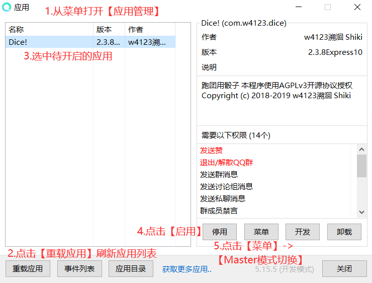

## Dice! Master手册

*For Ver 2.4.0*

### Master模式

Master是骰娘的控制者，每个骰娘同时至多只能有一个Master。Master可以控制骰娘的发言和行为，并个性化大量配置。受信任用户也可以获得对骰娘的部分权限，但只有Master拥有发放和回收高级权限的权限。

Master功能初始默认关闭，需要在酷Q的应用菜单中切换。

#### Master绑定/解绑

Master模式初次开启后为无主状态，此时对骰娘`.master (private/public)` 将绑定身份。  
`.master (private)` 默认**私骰作成**，将自动开启私用模式  
`.master public` **公骰作成**，将骰娘初始化为公骰，自动调整相应的配置  
`.master delete` 解除绑定，骰娘此时会重回无主状态，清空通知窗口，但先前设定的配置不会初始化。  
`.master reset [新masterQQ]` 解除绑定，骰娘此时会认主[新masterQQ]（原Master保留信任级别）  
`.master admin`添加管理时自动将私聊添加为监视窗口，管理可以用`.admin delete`放弃权限，清除窗口可以私聊`.admin notice - me`

### 控制台指令

#### 状态查看

`.admin state` 可以查看当前的全局设置和黑白名单情况  
**悬浮窗**：可右键**酷Q菜单->悬浮窗->Dice!->指令频度** 将悬浮窗显示的信息切换为每分钟的指令次数（实际是将5分钟内接受指令平滑化的结果）

#### 遥控开关

- `.admin boton/botoff [群号]` //等效于所在群群管使用.bot on/off
- `.dismiss [群号]` //可以遥控骰娘退出所在的群，即使骰娘不在，也能将该群移出白名单 

#### 消息发送(.send)

send用于用户与管理员间的远程交流  
`.send 待发送消息` （任何人可用）向Master发送消息  
`.send [窗口] [待发送消息]` //向指定窗口发送消息（权限4限定； **权限5用户发送的消息不会标明转发来源，等效于骰娘亲自说话** )

**窗口**是指QQ收发消息的聊天窗口。窗口参数识别一下5种格式:

- qq [QQ号]
- group [群号]
- discuss [讨论组号]
- this（发送指令的窗口）
- me（发送者的私聊窗口）

#### 消息转发(.link)

link用于管理员与特定窗口保持交流（尤其是新加入、待审核的群），或者操纵骰娘跑团  
`.link to/from/with [窗口]` 当前窗口向目标窗口单向转发/单向接收/双向转发消息  
`.link close` 关闭从当前聊天窗口发起的消息转发  
**转发自Master的消息不会标明转发来源，等效于骰娘亲自说话**  
**无法确认目标聊天窗口是否存在，可能会导致没有反应**  
**转发状态没有被写入文件，因此重载应用后会清空**

#### 系统指令(.system)

`.system save` //立即存储所有数据（相当于执行所有停用应用时的操作）  
`.system load` //立即读取外置文件（模块、牌堆和角色卡模板）。便于不重载应用的反复调试。save/load涉及的文件见附录。  
``.system state`` //显示插件运行时间及内存占用等硬件信息  
``.system clrimg`` //（不递归地）删除data\_static\文件夹下所有（文件名长度达32的）图片，但保留被Dice！引用的图片（如welcome）；有其他插件调用缓存图片且不另存于文件夹，**不要使用此命令**以免影响其他插件正常运作；每清除一万张图片大约需要半分钟至一分钟，**避免在业务繁忙时使用此命令**。**权限5可用**。  
`.system reload` //立即保存数据后令酷Q进程自杀并快速重启。第一次使用请保持远程连接监控，如重启后出现黄色提示框提醒上次未正常退出，请勾选【不再提醒】并确认，以免耽误重启。**Linux容器内的酷Q存在无法勾选的情况，请慎用**。**权限5可用**。  
`.system rexplorer` //杀死资源管理器后重启。当 Windows 服务器内存占用逐渐随时间而升高时，考虑由资源管理器逐渐占用内存导致，可能适用该指令。**权限5可用**。

#### 查看更新(.cloud update)

远程获取Dice!正式版及开发版信息  
`.cloud update` //检查版本更新  
`.cloud update release` //下载最新发布版  
`.cloud update dev` //下载最新开发版（请保持与开发者的交流）

#### 一键清群(.master groupclr)

遍历群列表并退出符合条件的群，**也可以在应用菜单中【一键清退】**。群列表上限500，**请避免群数超过500**  
`.master groupclr` 可以实现一键退群，无参数时默认参数为unpower  
`.master groupclr [天数]` 将退出当前所有**骰娘在指定天数内未发言**的群  
`.master groupclr unpower` 将退出当前所有**骰娘不是群管/群主**的群  
`.master groupclr preserve` 将退出当前所有**无许可使用**的群  
`.master groupclr black` 将退出当前所有**黑名单群**和**有危险的黑名单用户**的群

### 全局配置

配置项目表见附录  
`.admin [关键词]` //查看配置项状态，如.admin Private  
`.admin [关键词]=[数值]` //修改配置项。一般1表示开启，0表示关闭

#### 通知窗口

运行过程中产生的提醒、警告等通知消息会分类型发送给设置的通知窗口。所有通知被分为0-5六种类型（具体通知类型见附录）。当产生通知时，会向通知窗口中所有接收该类型通知的窗口发送消息。如果没有窗口能发送消息，骰娘会将通知发送给自己；无论如何所有通知会自动保存在"DiceData\audit"中，请定期整理该文件夹。

`.admin notice [窗口] +/-[通知类型](...+/-[通知类型])` //增减通知窗口类型  
`.admin notice - [窗口]` //直接移除指定窗口。

例:
- `.admin notice group 754494359 -0-1-2-3-4+5` 变更通知类型的接收情况  
- `.admin notice - this` 直接移除当前通知窗口

#### 全局开关(.admin DisabledGlobal=0/1)

DisabledGlobal=1等价于.admin off（全局关闭）。开启时一切如常，关闭则进入静默状态，所有群聊/讨论组会相当于.bot off状态而无视群内设置，私聊会回复关闭中的信息。也可以用.admin on/off 操作全局开启/关闭，也可以在应用菜单中点击"全局开关"自动切换。

#### 定时事件(.admin clock)

`.admin clock +/- on/off/save/clear [时]:[分]`  添加/移除 定时 全局开启/全局关闭/保存/清群  
每日执行，如果当日错过不会补回。  
定时开启和定时关闭时会向窗口4发送通知文本  
清群为基于黑名单清群(=.master groupclr black)

### 用户策略

#### 用户记录(.user)
用户在使用指令或被授予信任后会生成用户记录  
`.user state` //查看自己用户记录  
`.user trust [用户qq]` //查看用户信任级别（4以上限定，上级对下级屏蔽）  
`.user trust [用户qq] [信任级别]` //调整用户信任级别（4以上限定，只能调整下级用户）

##### 用户授信(.user trust)

每名登记用户会标记信任级别，初始为0。级别越高享受的权限越多，上级包含下级的所有权限。

`.admin whiteqq (-) [白名单QQ]` 可以为用户授予信任1(带减号为收回信任)


```eval_rst
+-------------------+--------------------------------------------------+
| 信任级别          | 权限                                             |
+===================+==================================================+
| 1（原用户白名单） | 为群分发使用许可，允许使用某些指令               |
+-------------------+--------------------------------------------------+
| 2                 | 黑名单豁免                                       |
+-------------------+--------------------------------------------------+
| 3                 | 响应退群指令，接受不良记录共享(warning)          |
+-------------------+--------------------------------------------------+
| 4（原管理）       | 查看、分发和收回低于4的用户权限，原管理权限      |
+-------------------+--------------------------------------------------+
| 5及以上           | 查看、分发和收回低于自身的用户权限，系统操作指令 |
+-------------------+--------------------------------------------------+
```

#### 监听好友申请(.admin ListenFriendRequest=1)

默认开启，仅好友验证方式为【需要验证信息】或【需要回答问题并由我确认】时有效，拦截消息并决定通过或拒绝。黑名单用户必定拒绝。同意好友邀请时将发送strAddFriend，特别地，通过受信任用户的好友时会发送strAddFriendWhiteQQ。当好友验证方式为【允许任何人】或【需要正确回答问题】时，通过开启**ListenFriendAdd**，也会向通过的好友发送strAddFriend，注意这种方式通过的好友可能仅为单向好友。

##### 允许陌生好友邀请(.admin AllowStranger=1/2)

默认为1。决定是否接受陌生人的好友邀请：2-无条件接受;1-无用户记录不接受;0-无信任不接受。该项设定建议配合QQ自带的【允许陌生人邀请我加入群聊】选项。

#### 单群设置(.group)

`.group ([群号])+/-[词条]` //修改单群设置，群内原地使用可省略群号

```eval_rst
+----------------------------------------------------+--------------------------------------------------+------------+
| 词条                                               | 作用                                             | 修改要求   |
+====================================================+==================================================+============+
| 许可使用                                           | 私用模式/审核模式可正常邀请入群/群内使用         | 信任1      |
+----------------------------------------------------+--------------------------------------------------+------------+
| 未审核                                             | 审核模式下标记新加入无【许可使用】的群，拒绝指令 | 信任1      |
+----------------------------------------------------+--------------------------------------------------+------------+
| 免清                                               | 清群时和搜查黑名单时略过该群                     | 信任2      |
+----------------------------------------------------+--------------------------------------------------+------------+
| 免黑                                               | 发生在该群的不良记录无效；不搜查黑名单           | 信任4      |
+----------------------------------------------------+--------------------------------------------------+------------+
| 忽略                                               | 不接受任何该群的事件                             | 信任4      |
+----------------------------------------------------+--------------------------------------------------+------------+
| 停用指令                                           | 停止响应指令和'.'开头的回复（即.bot off）        | 信任或群管 |
+----------------------------------------------------+--------------------------------------------------+------------+
| 禁用回复                                           | 停止响应自定义回复                               | 信任或群管 |
+----------------------------------------------------+--------------------------------------------------+------------+
| 拦截消息                                           | 拦截消息，阻止低优先级插件响应                   | 信任或群管 |
+----------------------------------------------------+--------------------------------------------------+------------+
| | 禁用jrrp/禁用me/禁用ob                           | 禁用对应指令                                     | 信任或群管 |
| | /禁用draw/禁用help                               |                                                  |            |
+----------------------------------------------------+--------------------------------------------------+------------+
```

- *原群白名单自动初始化为【许可使用】+【免清】*
- *重要的大群（跑团交流群、骰娘群）请加【免清】+【免黑】或【忽略】，以免意料之外的自动退群*
- `.admin whitegroup` 查看当前【许可使用】或【免清】或【免黑】的群列表

##### 授权许可(!authorize)

受信任用户可通过在群内发送!authorize或在任意窗口发送!authorize +[群号]来为目标群添加【许可使用】。非信任用户也可在群内使用!authorize [理由]向窗口2发送许可申请。  
`!authorize (+[群号])` //受信任用户为本群+许可使用  
`!authorize (+[群号]) [理由]`  //非信任用户申请本群许可

#### 监听群邀请(.admin ListenGroupRequest=1)

默认开启。接收用户的群邀请（**小群邀请**将由QQ系统自动通过，因此骰娘无法处理或知晓邀请人），拒绝来自黑名单的邀请，邀请来自受信任用户时通过且自动为群添加【许可使用】，非信任用户时私用模式而定。通过邀请的同时标记邀请人。

#### 入群检测(.admin ListenGroupAdd=1)

默认开启。遍历群员，获取群主信息（临时创建的群可能无法获取群管理信息）、检索黑名单，为私用模式二次确认【许可使用】，为审核模式检查【许可使用】。发送strAddGroup。

#### 私用模式(.admin Private=1)

认主时私骰作成进入私用模式，仅在**受信任**用户或【许可使用】群邀请时接受邀请，在**新加入管理员无信任用户**（否则为群自动添加【许可使用】）且**无【许可使用】的群**时自动退出，退出时自动留言。也可以用`.admin only/public` 切换私用/公用状态。

#### 审核模式(.admin CheckGroupLicense=1/2)
入群后，对于无【许可使用】的群，将自动标记【未审核】并发送strAddGroupNoLicense。该项生效时将拒绝提供除help之外的其他服务，其余指令仅authorize/dismiss/bot有效。该项为1时拒绝所有【未审核】的群（不溯及审核模式开启前已加入的群），该项为1时拒绝所有无【许可使用】的群（含开启前已加入的群）。

**审核模式与私用模式的差别**：

- 审核模式会在未许可群停留，增加潜在风险
- 留在群内有更高向用户群引流的概率
- 由于自动入群的小群无法正常给群加【许可使用】，骰娘在无法识别群管理的情况下会自动退群，需要受信任用户额外使用一次!authorize [群号]，重复邀请

#### 入群检测(.admin ListenGroupAdd=1)

默认开启。入群时反馈群信息（群名、群号、群人数、邀请人）；群内发现黑名单时会通知，有管理员是黑名单时会触发退群（群未设置【免清】或【免黑】时）。

#### 自动退出讨论组(.admin LeaveDiscuss=1)

开启**LeaveDiscuss**后，只要讨论组有人发言，就会自动退出讨论组。但开启后始终无人发言的讨论组无法处理，只能手动处理。*讨论组具有许多不适应酷Q的机制，如无法获取讨论组列表，无法获取邀请信息，无法获取成员列表，无法自动检测被踢。*

#### 黑名单(.admin blackqq/blackgroup)

任何情况下，来自黑名单的邀请不会被通过，指令除了dismiss都不会被响应  
`.admin blackgroup (-) ([黑名单理由]) [黑名单群号]` 可以添加群黑名单(带减号是删除)  
`.admin blackqq (-) ([黑名单理由]) [黑名单QQ]` 可以添加用户黑名单(带减号是删除)，带理由时危险等级为2且通知对方，否则危险等级为1。  
`.admin blackfriend` //查看好友列表内的黑名单用户  
**危险**的黑名单用户包括**群内权限更高**的用户或**非免清群内相同权限用户（可选）**，同时危险等级需要达到2。危险等级只有1的黑名单用户不通知、不会触发退群。  
*现在自己、Master、信任2以上用户都不会新加入黑名单。*

#### 不良行为检测(.admin ListenGroupLick/ListenGroupBan/ListenGroupSpam=1)

默认开启。分别开启后，移出、禁言、刷屏会被加入黑名单。生成危险等级2的不良记录后，会自动向通知5窗口广播生成的!warning指令。**warning指令**：接收到信任3或记录可识别的骰娘warning时，骰娘将自动录入黑名单。骰娘通过这一机制实现不良记录的传递共享。
拉黑群时会自动移除【许可使用】。  
*刷屏在程序内定义为发送指令超过20/30s，实际解释权归Master所有*

####  邀请人连带(.admin KickedBanInviter/BannedBanInviter=1)

默认开启。被移出、禁言时将入群邀请者同时加入黑名单。  
*邀请者责任源于协议中不得擅自拉群的规定，这里的擅自是双向的：一边无视骰娘协议，一边无视群内意愿*


### 个性化

#### 自定义帮助词条(.helpdoc)

`.helpdoc [词条名] [词条内容]` —— 自定义帮助词条  
词条内容以&开头表示重定向，如.helpdoc 追仙子 &追仙后，.help追仙子 将重定向到追仙的词条  
词条名**不需要是源代码中已有的**，请随意添加

**外置帮助文档**可放入DiceData/mod/读取。文件样例见附录。

#### 自定义回复(.reply)

当存在触发词与收到的消息完全一致时，将随机选择一项回复发送。当群内开启【禁用回复】时，不会响应回复。**触发回复也会算入刷屏计数！**  
`.reply [触发词] [回复文本1](...[回复文本N])` //收到触发词后，从N项回复中随机取一项  
`.reply [触发词]` //清除触发词

#### 自定义回执文本(.str)

将系统处理事件的回执替换为自定义文本  
`.[键值] [文本]` ——自定义骰娘的某类回执  
`.[键值] NULL` ——自定义文本为空白  
`.[键值] show` ——查看自定义文本

**强烈建议自定义strHlpMsg和strAddFriend、strAddGroup，向不熟悉的用户介绍私骰的特别之处（申请、使用须知）**

例:
```
.strSelfName 测试姬 //入群等自我介绍场合使用
.strSelfCall 本骰娘 //回执中用作自称，{self}的重定向
.strBotOn {self}开始工作了
.strAddGroup Shiki(Judgement), Servant Ruler, 四季映姫·ヤマザナドゥ。来，细数你的罪孽吧
.strRollFumble 大失败 就像是见了阎王一样
.strNameSet 以后就称呼{nick}的名称为{new_nick}了
```


**如果没有设置，strSelfName和strSelfCall将预设为QQ昵称，并且{self}会自动替换为strSelfCall**

#### 外置牌堆

将牌堆文件放入DiceData/PublicDeck内并重启或load，即可使用牌堆内的条目。牌堆名以'_'开头时，无法直接使用draw命令抽取。

### 附录

#### 默认回执文本

可用的键值如下表（已用json格式表出，复制入CustomMsg.json时注意保持格式并**去除注释**）

```json
{
	"strParaEmpty":"参数不能为空×",			//偷懒用万能回复
	"strParaIllegal":"参数非法×",			//偷懒用万能回复
	"stranger":"用户",			//{nick}无法获取非空昵称时的称呼
	"strAdminOptionEmpty":"找{self}有什么事么？{nick}",			//
	"strGMTableShow":"{self}记录的{table_name}列表：",
	"strGMTableNotExist":"{self}没有保存的{table_name}记录",
	"strUserTrustShow":"{user}在{self}处的信任级别为{trust}",
	"strUserTrusted":"已将{self}对{user}的信任级别调整为{trust}",
	"strUserTrustDenied":"{nick}在{self}处无权访问对方的权限×",
	"strUserTrustIllegal":"将目标权限修改为{trust}是非法的×",
	"strUserNotFound":"{self}无{user}的用户记录",
	"strGroupAuthorized":"A roll to the table turns to a dice fumble!\nDice Roller {strSelfName}√\n本群已授权许可，请尽情使用本骰娘√\n请遵守协议使用，服务结束后使用.dismiss送出!",
	"strAddGroupNoLicense":"本群未获{self}许可使用，将自动在群内静默。\n请先.help协议 阅读并同意协议后向运营方申请许可使用，\n否则请管理员使用!dismiss送出{self}\n可按以下格式填写并发送申请:\n!authorize 申请用途:[理由] 我已了解Dice!基本用法，仔细阅读并保证遵守{strSelfName}的用户协议，如需停用指令使用[指令]，用后使用[指令]送出群",
	"strGroupLicenseDeny":"此群未获{self}许可使用，请先确认协议并申请许可×\n或请管理员使用!dismiss送出{self}",
	"strGroupLicenseApply":"此群未通过自助授权×\n许可申请已发送√",
	"strGroupSetOn":"现已开启{self}在此群的“{option}”选项√",			//群内开关和遥控开关通用此文本
	"strGroupSetOnAlready":"{self}已在此群设置了{option}！",			
	"strGroupSetOff":"现已关闭{self}在此群的“{option}”选项√",			
	"strGroupSetOffAlready":"{self}未在此群设置{option}！",
	"strGroupSetAll":"{self}已修改记录中{cnt}个群的“{option}”选项√",
	"strGroupDenied":"{nick}在{self}处无权访问此群的设置×",
	"strGroupSetDenied":"{nick}在{self}处设置{option}的权限不足×",
	"strGroupSetNotExist":"{self}无{option}此选项×",
	"strGroupWholeUnban":"{self}已关闭全局禁言√",
	"strGroupWholeBan":"{self}已开启全局禁言√",
	"strGroupWholeBanErr":"{self}开启全局禁言失败×",
	"strGroupUnban":"{self}裁定:{member}解除禁言√",
	"strGroupBan":"{self}裁定:{member}禁言{res}分钟√",
	"strGroupBanErr":"{self}禁言{member}失败×",
	"strGroupNotFound":"{self}无该群记录×",
	"strGroupNotIn":"{self}当前不在该群或对象不是群！",
	"strGroupExit":"{self}已退出该群√",
	"strGroupCardSet":"{self}已将{target}的群名片修改为{card}√",
	"strGroupCardSetErr":"{self}设置{target}的群名片失败×",
	"strGroupTitleSet":"{self}已将{target}的头衔修改为{title}√",
	"strGroupTitleSetErr":"{self}设置{target}的头衔失败×",
	"strPcNewEmptyCard":"已为{nick}新建{type}空白卡{char}√",
	"strPcNewCardShow":"已为{nick}新建{type}卡{char}：{show}",//由于预生成选项而存在属性
	"strPcCardSet":"已将{nick}当前角色卡绑定为{char}√",//{nick}-用户昵称 {pc}-原角色卡名 {char}-新角色卡名
	"strPcCardReset":"已解绑{nick}当前的默认卡√",//{nick}-用户昵称 {pc}-原角色卡名
	"strPcCardRename":"已将{old_name}重命名为{new_name}√",
	"strPcCardDel":"已将角色卡{char}删除√",
	"strPcCardCpy":"已将{char2}的属性复制到{char1}√",
	"strPcClr":"已清空{nick}的角色卡记录√",
	"strPcCardList":"{nick}的角色列表：{show}",
	"strPcCardBuild":"{nick}的{char}生成：{show}",
	"strPcCardShow":"{nick}的<{type}>{char}：{show}",	//{nick}-用户昵称 {type}-角色卡类型 {char}-角色卡名
	"strPcCardRedo":"{nick}的{char}重新生成：{show}",
	"strPcGroupList":"{nick}的各群角色列表：{show}",
	"strPcNotExistErr":"{self}无{nick}的角色卡记录，无法删除×",
	"strPcCardFull":"{nick}在{self}处的角色卡已达上限，请先清理多余角色卡×",
	"strPcTempInvalid":"{self}无法识别的角色卡模板×",
	"strPcNameEmpty":"名称不能为空×",
	"strPcNameExist":"已存在同名卡×",
	"strPcNameNotExist":"该名称不存在×",
	"strPcNameInvalid":"非法的人物卡名（存在冒号）×",
	"strPcInitDelErr":"初始卡不可删除×",
	"strPcNoteTooLong":"备注长度不能超过255×",
	"strPcTextTooLong":"文本长度不能超过48×",
	"strSpamFirstWarning":"你短时间内对{self}指令次数过多！请善用多轮掷骰和复数生成指令（刷屏初次警告）",
	"strSpamFinalWarning":"请暂停你的一切指令，避免因高频指令被{self}拉黑！（刷屏最终警告）",
	"strReplySet":"{self}对关键词{key}的回复已设置√",
	"strReplyDel":"{self}对关键词{key}的回复已清除√",
	"strStModify":"{self}对已记录{pc}的属性变化:",		//存在技能值变化情况时，优先使用此文本
	"strStDetail":"{self}对已设置{pc}的属性：",		//存在掷骰时，使用此文本(暂时无用)
	"strStValEmpty":"{self}未记录{attr}原值×",		//{attr}为属性名
	"strBlackQQAddNotice":"{user_nick}，你已被{self}加入黑名单，详情请联系Master",				
	"strBlackQQAddNoticeReason":"{user_nick}，由于{reason}，你已被{self}加入黑名单，申诉解封请联系管理员",
	"strBlackQQDelNotice":"{user_nick}，你已被{self}移出黑名单，现在可以继续使用了",
	"strWhiteQQAddNotice":"{user_nick}，您已获得{self}的信任，请尽情使用{self}√",
	"strWhiteQQDenied":"你不是{self}信任的用户×",
	"strWhiteGroupDenied":"本群聊不在白名单中×",
	"strDeckProNew":"已新建自定义牌堆√",
	"strDeckProSet":"已将{key}设置为默认牌堆√",
	"strDeckProClr":"已删除默认牌堆√",
	"strDeckProNull":"默认牌堆不存在!",
	"strDeckTmpReset":"已重置卡牌√",
	"strDeckTmpShow":"当前剩余卡牌:",
	"strDeckTmpEmpty":"已无剩余卡牌！",		//剩余卡牌数为0
	"strDeckTmpNotFound":"不存在剩余卡牌×",	//没有生成过牌堆
	"strDeckNameEmpty":"未指定牌堆名×",
	"strRollDice":"{pc}掷骰: {res}",
	"strRollDiceReason":"{pc}掷骰 {reason}: {res}",
	"strRollHidden":"{pc}进行了一次暗骰",
	"strRollTurn":"{pc}的掷骰轮数: {turn}轮",
	"strRollMultiDice":"{pc}掷骰{turn}次: {dice_exp}={res}",
	"strRollMultiDiceReason":"{pc}掷骰{turn}次{reason}: {dice_exp}={res}",
	"strRollSkill":"{pc}进行{attr}检定：",
	"strRollSkillReason":"由于{reason} {pc}进行{attr}检定：",
	"strEnRoll":"{pc}的{attr}增强或成长检定：\n{res}",//{attr}在用户省略技能名后替换为{strEnDefaultName}
	"strEnRollNotChange":"{strEnRoll}\n{pc}的{attr}值没有变化",
	"strEnRollFailure":"{strEnRoll}\n{pc}的{attr}变化{change}点，当前为{final}点",
	"strEnRollSuccess":"{strEnRoll}\n{pc}的{attr}增加{change}点，当前为{final}点",
	"strEnDefaultName":"属性或技能",	//默认文本
	"strEnValEmpty": "未对{self}设定待成长属性值，请先.st {attr} 属性值 或查看.help en×",
	"strEnValInvalid": "{attr}值输入不正确,请输入1-99范围内的整数!",
	"strSendMsg":"{self}已将消息送出√",//Master定向发送的回执
	"strSendMasterMsg":"消息{self}已发送给Master√",//向Master发送的回执
	"strSendMsgEmpty":"发送消息内容为空×",
	"strSendMsgInvalid":"{self}没有可以发送的对象×",//没有Master
	"strDefaultCOCClr":"默认检定房规已清除√",
	"strDefaultCOCNotFound":"默认检定房规不存在×",
	"strDefaultCOCSet":"默认检定房规已设置:",
	"strLinkLoss":"{self}的时空连接已断开√",
	"strLinked":"{self}已创建时空门√",
	"strLinkWarning":"尝试创建时空门，但不保证能否连通",
	"strLinkNotFound":"时空门要通向不可名状的地方了×",
	"strNotMaster":"你不是{self}的master！你想做什么？",
	"strNotAdmin":"你不是{self}的管理员×",
	"strDismiss": "",						//.dismiss退群前的回执
	"strHlpSet":"已为{key}设置词条√",
	"strHlpReset":"已清除{key}的词条√",
	"strHlpNameEmpty":"Master想要自定义什么词条呀？",
	"strHlpNotFound":"{self}未找到指定的帮助信息×",
	"strClockToWork":"{self}已按时启用√",
	"strClockOffWork":"{self}已按时关闭√",
	"strNameGenerator":"{pc}的随机名称：{res}",
	"strDrawCard": "来看看{pc}抽到了什么：{res}",
	"strMeOn":"成功在这里启用{self}的.me命令√",
	"strMeOff":"成功在这里禁用{self}的.me命令√",
	"strMeOnAlready":"在这里{self}的.me命令没有被禁用!",
	"strMeOffAlready":"在这里{self}的.me命令已经被禁用!",
	"strObOn":"成功在这里启用{self}的旁观模式√",
	"strObOff":"成功在这里禁用{self}的旁观模式√",
	"strObOnAlready":"在这里{self}的旁观模式没有被禁用!",
	"strObOffAlready":"在这里{self}的旁观模式已经被禁用!",
	"strObList":"当前{self}的旁观者有:",
	"strObListEmpty":"当前{self}暂无旁观者",
	"strObListClr":"{self}成功删除所有旁观者√",
	"strObEnter":"{nick}成功加入{self}的旁观√",
	"strObExit":"{nick}成功退出{self}的旁观√",
	"strObEnterAlready":"{nick}已经处于{self}的旁观模式!",
	"strObExitAlready":"{nick}没有加入{self}的旁观模式!",
	"strQQIDEmpty":"QQ号不能为空×",
	"strGroupIDEmpty":"群号不能为空×",
	"strBlackGroup": "该群在黑名单中，如有疑问请联系master",
	"strBotOn":"成功开启{self}√",
	"strBotOff":"成功关闭{self}√",
	"strBotOnAlready":"{self}已经处于开启状态!",
	"strBotOffAlready":"{self}已经处于关闭状态!",
	"strRollCriticalSuccess":"大成功！",//一般检定用
	"strRollExtremeSuccess":"极难成功",
	"strRollHardSuccess":"困难成功",
	"strRollRegularSuccess":"成功",
	"strRollFailure":"失败",
	"strRollFumble":"大失败！",
	"strFumble": "大失败!",//多轮检定用，请控制长度
	"strFailure": "失败",
	"strSuccess": "成功",
	"strHardSuccess": "困难成功",
	"strExtremeSuccess": "极难成功",
	"strCriticalSuccess": "大成功!",
	"strNumCannotBeZero": "无意义的数目！莫要消遣于我!",
	"strDeckNotFound": "是说{deck_name}？{self}没听说过的牌堆名呢……",
	"strDeckEmpty": "{self}已经一张也不剩了！",
	"strNameNumTooBig": "生成数量过多!请输入1-10之间的数字!",
	"strNameNumCannotBeZero": "生成数量不能为零!请输入1-10之间的数字!",
	"strSetInvalid": "无效的默认骰!请输入1-9999之间的数字!",
	"strSetTooBig": "这面数……让我丢个球啊!请输入1-9999之间的数字!",
	"strSetCannotBeZero": "默认骰不能为零!请输入1-9999之间的数字!",
	"strCharacterCannotBeZero": "人物作成次数不能为零!请输入1-10之间的数字!",
	"strCharacterTooBig": "人物作成次数过多!请输入1-10之间的数字!",
	"strCharacterInvalid": "人物作成次数无效!请输入1-10之间的数字!",
	"strSanRoll":"{pc}的San Check：\n{res}",
	"strSanRollRes":"{strSanRoll}\n{pc}的San值减少{change}点,当前剩余{final}点",
	"strSanCostInvalid": "SC表达式输入不正确,格式为成功扣San/失败扣San,如1/1d6!",
	"strSanInvalid": "San值输入不正确,请输入1-99范围内的整数!",
	"strSanEmpty": "未设定San值，请先.st san 或查看.help sc×",
	"strSuccessRateErr":"这成功率还需要检定吗？",
	"strGroupIDInvalid": "无效的群号!",
	"strSendErr": "消息发送失败!",
	"strSendSuccess":"命令执行成功√",
	"strDisabledErr": "命令无法执行:机器人已在此群中被关闭!",
	"strActionEmpty":"动作不能为空×",
	"strMEDisabledErr": "管理员已在此群中禁用.me命令!",
	"strDisabledMeGlobal": "恕不提供.me服务×",
	"strDisabledJrrpGlobal": "恕不提供.jrrp服务×",
	"strDisabledDeckGlobal": "恕不提供.deck服务×",
	"strDisabledDrawGlobal": "恕不提供.draw服务×",
	"strDisabledSendGlobal": "恕不提供.send服务×",
	"strHELPDisabledErr": "管理员已在此群中禁用.help命令!",
	"strNameDelEmpty": "{nick}没有设置名称,无法删除!",
	"strValueErr": "掷骰表达式输入错误!",
	"strInputErr": "命令或掷骰表达式输入错误!",
	"strUnknownErr": "发生了未知错误!",
	"strUnableToGetErrorMsg": "无法获取错误信息!",
	"strDiceTooBigErr": "{self}被你扔出的骰子淹没了×",
	"strRequestRetCodeErr": "访问服务器时出现错误! HTTP状态码: {error}",
	"strRequestNoResponse": "服务器未返回任何信息×",
	"strTypeTooBigErr": "哇!让我数数骰子有多少面先~1...2...",
	"strZeroTypeErr": "这是...!!时空裂({self}被骰子产生的时空裂缝卷走了)",
	"strAddDiceValErr": "你这样要让{self}扔骰子扔到什么时候嘛~(请输入正确的加骰参数:5-10之内的整数)",
	"strZeroDiceErr": "咦?我的骰子呢?",
	"strRollTimeExceeded": "掷骰轮数超过了最大轮数限制!",
	"strRollTimeErr": "异常的掷骰轮数",
	"strObPrivate": "你想看什么呀？",
	"strDismissPrivate": "滚！",
	"strWelcomePrivate": "你在这欢迎谁呢？",
	"strWelcomeMsgClearNotice": "已清除本群的入群欢迎词√",
	"strWelcomeMsgClearErr": "没有设置入群欢迎词，清除失败×",
	"strWelcomeMsgUpdateNotice": "{self}已更新本群的入群欢迎词√",
	"strPermissionDeniedErr": "请让群内管理对{self}发送该指令×",
	"strSelfPermissionErr":"{self}权限不够无能为力呢×",
	"strNameTooLongErr": "名称过长×(最多为50英文字符)",
	"strNameClr":"已将{nick}的名称删除√",
	"strNameSet":"已将{nick}的名称更改为{new_nick}√",
	"strUnknownPropErr": "未设定{attr}成功率，请先.st {attr} 技能值 或查看.help rc×",
	"strEmptyWWDiceErr": "格式错误:正确格式为.w(w)XaY!其中X≥1, 5≤Y≤10",
	"strPropErr": "请认真的输入你的属性哦~",
	"strSetPropSuccess": "属性设置成功√",
	"strPropCleared": "已清空{char}的所有属性√",
	"strRuleReset":"已重置默认规则√",
	"strRuleSet":"已设置默认规则√",
	"strRuleErr": "规则数据获取失败,具体信息:\n",
	"strRulesFailedErr": "请求失败,{self}无法连接数据库×",
	"strPropDeleted": "已删除{pc}的{attr}√",
	"strPropNotFound": "属性{attr}不存在×",
	"strRuleNotFound": "{self}未找到对应的规则信息×",
	"strProp": "{pc}的{attr}为{val}",
	"strPropList": "{nick}的{char}属性列表为：{show}", 
	"strStErr": "格式错误:请参考.help st获取.st命令的使用方法",
	"strRulesFormatErr": "格式错误:正确格式为.rules[规则名称:]规则条目 如.rules COC7:力量",
	"strLeaveDiscuss": "{self}现不支持讨论组服务，即将退出",
	"strLeaveNoPower": "{self}未获得群管理，即将退群",
	"strLeaveUnused":"{self}已经在这里被放置{day}天啦，马上就会离开这里了",
	"strGlobalOff":"{self}休假中，暂停服务×",
	"strPreserve": "{self}私有私用，勿扰勿怪\n如需申请许可请发送!authorize +[群号] [申请理由]",
	"strJrrp": "{nick}今天的人品值是: {res}",
	"strJrrpErr": "JRRP获取失败! 错误信息: \n{res}",
	"strAddFriendWhiteQQ":"{strAddFriend}",				//白名单用户添加好友时回复此句
	"strAddFriend", "欢迎使用{strSelfName}！\n.help协议 确认服务协议\n.help指令 查看指令列表\n.help设定 确认骰娘设定\n.help链接 查看源码文档\n使用服务默认已经同意服务协",					//同意添加好友时额外发送的语句
	"strAddGroup", "欢迎使用{strSelfName}！\n请使用.dismiss QQ号（或后四位） 使{self}退群退讨论组\n.bot on/off QQ号（或后四位） //开启或关闭指令\n.group +/-禁用回复 //禁用或启用回复\n.help协议 确认服务协议\n.help指令 查看指令列表\n.help设定 确认骰娘设定\n.help链接 查看源码文档\n邀请入群默认视为同意服务协议，知晓禁言或移出的后果",
	"strSelfName": "",
	"strSelfCall": "&strSelfName",
	"self": "&strSelfCall",
	"strBotMsg": "\n使用.help更新 查看{self}更新内容",
	"strHlpMsg" , "请使用.dismiss QQ号（或后四位） 使{self}退群退讨论组\n.bot on/off QQ号（或后四位） //开启或关闭指令\n.help协议 确认服务协议\n.help指令 查看指令列表\n.help群管 查看群管指令\n.help设定 确认骰娘设定\n.help链接 查看源码文档\n开发交流群：1029435374\n私骰分流群：863062599"
}
```

#### 配置项目表
**注：Disabled是不可用的意思！**

```eval_rst
+---------------------+----------+------------------------------------------------------+
| 关键词              | 默认状态 | 说明                                                 |
+=====================+==========+======================================================+
| DisabledGlobal      | 0        | 全局静默，只响应dismiss和bot，私聊会说明             |
+---------------------+----------+------------------------------------------------------+
| DisabledBlock       | 0        | bot off时拦截消息，阻止低优先级插件响应              |
+---------------------+----------+------------------------------------------------------+
| DisabledListenAt    | 1        | 停用指令时可以通过at指名响应指令                     |
+---------------------+----------+------------------------------------------------------+
| DisabledMe          | 0        | 拒绝响应.me                                          |
+---------------------+----------+------------------------------------------------------+
| DisabledJrrp        | 0        | 拒绝响应.jrrp                                        |
+---------------------+----------+------------------------------------------------------+
| DisabledDeck        | 1        | 拒绝响应.deck                                        |
+---------------------+----------+------------------------------------------------------+
| DisabledDraw        | 0        | 拒绝响应.draw                                        |
+---------------------+----------+------------------------------------------------------+
| DisabledSend        | 0        | 拒绝响应.send                                        |
+---------------------+----------+------------------------------------------------------+
| Private             | 0        | 私用模式开启（私骰作成=1）                           |
+---------------------+----------+------------------------------------------------------+
| LeaveDiscuss        | 0        | 检测到讨论组发言时自动退出                           |
+---------------------+----------+------------------------------------------------------+
| ListenGroupRequest  | 1        | 响应群添加请求                                       |
+---------------------+----------+------------------------------------------------------+
| ListenGroupAdd      | 1        | 响应入群反馈                                         |
+---------------------+----------+------------------------------------------------------+
| ListenFriendRequest | 1        | 响应好友添加请求                                     |
+---------------------+----------+------------------------------------------------------+
| ListenFriendAdd     | 1        | 响应好友添加反馈（由插件通过则不重复）               |
+---------------------+----------+------------------------------------------------------+
| AllowStranger       | 0        | 私用模式下允许非白名单好友申请（公骰作成=1）         |
+---------------------+----------+------------------------------------------------------+
| ListenGroupKick     | 1        | 响应群移出事件                                       |
+---------------------+----------+------------------------------------------------------+
| ListenGroupBan      | 1        | 响应群禁言事件                                       |
+---------------------+----------+------------------------------------------------------+
| ListenSpam          | 1        | 响应刷屏监测                                         |
+---------------------+----------+------------------------------------------------------+
| LeaveBlackQQ        | 0        | 检测群权限相同的黑名单用户时自动退出（公骰作成=1）   |
+---------------------+----------+------------------------------------------------------+
| BannedLeave         | 0        | 被禁言后自动退群（公骰作成=1）                       |
+---------------------+----------+------------------------------------------------------+
| BannedBanInviter    | 0        | 被禁言后拉黑邀请者（公骰作成=1）                     |
+---------------------+----------+------------------------------------------------------+
| KickedBanInviter    | 0        | 被踢后拉黑邀请者（公骰作成=1）                       |
+---------------------+----------+------------------------------------------------------+
| BelieveDiceList     | 0        | 信任来自骰娘列表成员的warning（公骰作成=1）          |
+---------------------+----------+------------------------------------------------------+
| CloudVisible        | 1        | 允许通过骰娘网络公开骰娘的QQ和其他信息               |
+---------------------+----------+------------------------------------------------------+
| CloudBlackShare     | 1        | 调节是否与云端互通不良记录                         |
+---------------------+----------+------------------------------------------------------+
| SystemAlarmCPU      | 90       | 系统CPU占用触发报警的百分比阈值（0则不检测）         |
+---------------------+----------+------------------------------------------------------+
| SystemAlarmRAM      | 90       | 系统内存占用触发报警的百分比阈值（0则不检测）        |
+---------------------+----------+------------------------------------------------------+
| SendIntervalIdle    | 500      | 闲时消息队列处理一条消息发送的间隔(ms)               |
+---------------------+----------+------------------------------------------------------+
| SendIntervalBusy    | 100      | 忙时消息队列处理一条消息发送的间隔(ms)               |
+---------------------+----------+------------------------------------------------------+
```

**指令禁用对信任4以上用户无效**  
*如果使用了容易刷屏又没有独立开关的回复插件，建议开启DisabledBlock并令Dice拥有更高优先级*  
*对.me特别处理的理由是其在跑团中几乎零作用，却可以制造骰娘自己说话的假象，引发风险。*

#### 通知类型表

```eval_rst
+-----------------------+--------------+----------+
| 事件                  | 554输出      | 通知类型 |
+=======================+==============+==========+
| 启动初始化            | 发送recorder | 0        |
+-----------------------+--------------+----------+
| 自定义回执文本        | 发送recorder | 0        |
+-----------------------+--------------+----------+
| 接收响应的warning     | 发送recorder | 0        |
+-----------------------+--------------+----------+
| 非黑受邀入群          | 发送recorder | 0        |
+-----------------------+--------------+----------+
| 非黑好友申请          | 发送recorder | 0        |
+-----------------------+--------------+----------+
| 刷屏初次提醒          | 发送recorder | 0        |
+-----------------------+--------------+----------+
| 解除禁言提醒          | 发送admin    | 1        |
+-----------------------+--------------+----------+
| 增减黑名单            | 发送recorder | 1        |
+-----------------------+--------------+----------+
| 接收warning处理反馈   | 发送admin    | 1        |
+-----------------------+--------------+----------+
| 申请/入群检测到黑名单 | 发送admin    | 1        |
+-----------------------+--------------+----------+
| 黑名单触发退群        | 发送admin    | 1        |
+-----------------------+--------------+----------+
| 接收陌生warning       | 发送admin    | 1        |
+-----------------------+--------------+----------+
| 自定义全局设置        | 发送recorder | 1        |
+-----------------------+--------------+----------+
| 信任等级变动          | 发送admin    | 1        |
+-----------------------+--------------+----------+
| 遥控单群退群/群设置   | 无           | 1        |
+-----------------------+--------------+----------+
| 撤销管理员            | 发送admin    | 2        |
+-----------------------+--------------+----------+
| 批量修改群设置        | 无           | 2        |
+-----------------------+--------------+----------+
| 接收send信息          | 发送admin    | 2        |
+-----------------------+--------------+----------+
| 群聊清查              | 发送recorder | 2        |
+-----------------------+--------------+----------+
| 刷屏二次提醒          | 发送admin    | 3        |
+-----------------------+--------------+----------+
| 原生不良记录          | 发送monitor  | 3        |
+-----------------------+--------------+----------+
| 系统负载报警          | 无           | 3        |
+-----------------------+--------------+----------+
| 切换公用/私用（only） | 发送admin    | 4        |
+-----------------------+--------------+----------+
| 定时开关              | 发送monitor  | 4        |
+-----------------------+--------------+----------+
| 生成warning           | 发送monitor  | 5        |
+-----------------------+--------------+----------+
```

#### 文件位置表

```eval_rst
+----------------------------------+------------------------------+--------------------+
| 文件路径                         | 说明                         | 读写时机           |
+==================================+==============================+====================+
| DiceData/conf/Console.xml        | Master模式配置               | 修改时写入         |
+----------------------------------+------------------------------+--------------------+
| DiceData/conf/NoticeList.txt     | 通知窗口列表                 | 修改时写入         |
+----------------------------------+------------------------------+--------------------+
| DiceData/conf/CustomMsg.json     | 自定义回执文本               | 修改时写入         |
+----------------------------------+------------------------------+--------------------+
| DiceData/conf/CustomHelp.json    | 自定义帮助文本               | 修改时写入         |
+----------------------------------+------------------------------+--------------------+
| DiceData/conf/CustomReply.json   | 自定义回复文本               | 修改时写入         |
+----------------------------------+------------------------------+--------------------+
| DiceData/conf/BlackList.json     | 黑名单记录                   | 修改时写入         |
+----------------------------------+------------------------------+--------------------+
| DiceData/user/UserList.txt       | 用户信任、时间记录           | 退出或save时写入   |
+----------------------------------+------------------------------+--------------------+
| DiceData/user/UserConf.RDconf    | 用户配置                     | 退出或save时写入   |
+----------------------------------+------------------------------+--------------------+
| DiceData/user/ChatList.txt       | 群聊时间记录、邀请人         | 退出或save时写入   |
+----------------------------------+------------------------------+--------------------+
| DiceData/user/ChatConf.RDconf    | 群聊配置                     | 退出或save时写入   |
+----------------------------------+------------------------------+--------------------+
| DiceData/user/PlayerCards.RDconf | 角色卡记录                   | 退出或save时写入   |
+----------------------------------+------------------------------+--------------------+
| DiceData/user/session/           | 团内记录（先攻、ob）         | 修改时写入         |
+----------------------------------+------------------------------+--------------------+
| DiceData/audit/                  | 消息通知日志                 | 更新时写入         |
+----------------------------------+------------------------------+--------------------+
| DiceData/mod/                    | 模块文件（目前限定帮助文档） | load时读取，不写入 |
+----------------------------------+------------------------------+--------------------+
| DiceData/PublicDeck/             | 外置牌堆                     | load时读取，不写入 |
+----------------------------------+------------------------------+--------------------+
| DiceData/CardTemp/               | 角色卡模板                   | load时读取，不写入 |
+----------------------------------+------------------------------+--------------------+
```

#### Mod文件示例

```json
{
    "mod":"塔罗",
    "author":"Shiki",
    "brief":"外置模块样例文档",
    "comment":"模块信息当前版本在插件内没有实际作用",
    "helpdoc":{
		"塔罗":"塔罗牌，由“TAROT”一词音译而来，被称为“大自然的奥秘库”。它是西方古老的占卜工具，中世纪起流行于欧洲，地位相当于中国的《周易》",
        "愚者正位":"憧憬自然的地方、毫无目的地前行、喜欢尝试挑战新鲜事物、四处流浪。美好的梦想。",
        "愚者逆位":"冒险的行动，追求可能性，重视梦想，无视物质的损失，离开家园，过于信赖别人，为出外旅行而烦恼。心情空虚、轻率的恋情、无法长久持续的融洽感、不安的爱情的旅程、对婚姻感到束缚、彼此忽冷忽热、不顾众人反对坠入爱河、为恋人的负心所伤、感情不专一。",
        "魔术师正位":"事情的开始，行动的改变，熟练的技术及技巧，贯彻我的意志，运用自然的力量来达到野心。",
        "魔术师逆位":"意志力薄弱，起头难，走入错误的方向，知识不足，被骗和失败。",
        "女祭司正位":"开发出内在的神秘潜力，前途将有所变化的预言，深刻地思考，敏锐的洞察力，准确的直觉。",
        "女祭司逆位":"过于洁癖，无知，贪心，目光短浅，自尊心过高，偏差的判断，有勇无谋，自命不凡。",
        "女皇正位":"幸福，成功，收获，无忧无虑，圆满的家庭生活，良好的环境，美貌，艺术，与大自然接触，愉快的旅行，休闲。",
        "女皇逆位":"不活泼，缺乏上进心，散漫的生活习惯，无法解决的事情，不能看到成果，担于享乐，环境险恶，与家人发生纠纷。",
        "皇帝正位":"光荣，权力，胜利，握有领导权，坚强的意志，达成目标，父亲的责任，精神上的孤单。",
        "皇帝逆位":"幼稚，无力，独裁，撒娇任性，平凡，没有自信，行动力不足，意志薄弱，被支配。",
        "教皇正位":"援助，同情，宽宏大量，可信任的人给予的劝告，良好的商量对象，得到精神上的满足，遵守规则，志愿者。",
        "教皇逆位":"错误的讯息，恶意的规劝，上当，援助被中断，愿望无法达成，被人利用，被放弃。",
        "恋人正位":"撮合，爱情，流行，兴趣，充满希望的未来，魅力，增加朋友。",
        "恋人逆位":"禁不起诱惑，纵欲过度，反覆无常，友情变淡，厌倦，争吵，华丽的打扮，优柔寡断。",
        "战车正位":"努力而获得成功，胜利，克服障碍，行动力，自立，尝试，自我主张，年轻男子，交通工具，旅行运大吉。",
        "战车逆位":"争论失败，发生纠纷，阻滞，违返规则，诉诸暴力，顽固的男子，突然的失败，不良少年，挫折和自私自利。",
        "力量正位":"大胆的行动，有勇气的决断，新发展，大转机，异动，以意志力战胜困难，健壮的女人。",
        "力量逆位":"胆小，输给强者，经不起诱惑，屈服在权威与常识之下，没有实践便告放弃，虚荣，懦弱，没有耐性。",
        "隐者正位":"隐藏的事实，个别的行动，倾听他人的意见，享受孤独，有益的警戒，年长者，避开危险，祖父，乡间生活。",
        "隐者逆位":"憎恨孤独，自卑，担心，幼稚思想，过于慎重导致失败，偏差，不宜旅行。",
        "命运之轮正位":"关键性的事件，有新的机会，因的潮流，环境的变化，幸运的开端，状况好转，问题解决，幸运之神降临。",
        "命运之轮逆位":"挫折，计划泡汤，障碍，无法修正方向，往坏处发展，恶性循环，中断。",
        "正义正位":"公正、中立、诚实、心胸坦荡、表里如一、身兼二职、追求合理化、协调者、与法律有关、光明正大的交往、感情和睦。",
        "正义逆位":"失衡、偏见、纷扰、诉讼、独断专行、问心有愧、无法两全、表里不一、男女性格不合、情感波折、无视社会道德的恋情。",
        "倒吊人正位":"接受考验、行动受限、牺牲、不畏艰辛、不受利诱、有失必有得、吸取经验教训、浴火重生、广泛学习、奉献的爱。",
        "倒吊人逆位":"无谓的牺牲、骨折、厄运、不够努力、处于劣势、任性、利己主义者、缺乏耐心、受惩罚、逃避爱情、没有结果的恋情。",
        "死神正位":"失败、接近毁灭、生病、失业、维持停滞状态、持续的损害、交易停止、枯燥的生活、别离、重新开始、双方有很深的鸿沟、恋情终止。",
        "死神逆位":"抱有一线希望、起死回生、回心转意、摆脱低迷状态、挽回名誉、身体康复、突然改变计划、逃避现实、斩断情丝、与旧情人相逢。",
        "节制正位":"单纯、调整、平顺、互惠互利、好感转为爱意、纯爱、深爱。",
        "节制逆位":"消耗、下降、疲劳、损失、不安、不融洽、爱情的配合度不佳。",
        "恶魔正位":"被束缚、堕落、生病、恶意、屈服、欲望的俘虏、不可抗拒的诱惑、颓废的生活、举债度日、不可告人的秘密、私密恋情。",
        "恶魔逆位":"逃离拘束、解除困扰、治愈病痛、告别过去、暂停、别离、拒绝诱惑、舍弃私欲、别离时刻、爱恨交加的恋情。",
        "塔正位":"破产、逆境、被开除、急病、致命的打击、巨大的变动、受牵连、信念崩溃、玩火自焚、纷扰不断、突然分离，破灭的爱。",
        "塔逆位":"困境、内讧、紧迫的状态、状况不佳、趋于稳定、骄傲自大将付出代价、背水一战、分离的预感、爱情危机。",
        "星星正位":"前途光明、充满希望、想象力、创造力、幻想、满足愿望、水准提高、理想的对象、美好的恋情。",
        "星星逆位":"挫折、失望、好高骛远、异想天开、仓皇失措、事与愿违、工作不顺心、情况悲观、秘密恋情、缺少爱的生活。",
        "月亮正位":"不安、迷惑、动摇、谎言、欺骗、鬼迷心窍、动荡的爱、三角关系。",
        "月亮逆位":"逃脱骗局、解除误会、状况好转、预知危险、等待、正视爱情的裂缝。",
        "太阳正位":"活跃、丰富的生命力、充满生机、精力充沛、工作顺利、贵人相助、幸福的婚姻、健康的交际。",
        "太阳逆位":"消沉、体力不佳、缺乏连续性、意气消沉、生活不安、人际关系不好、感情波动、离婚。",
        "审判正位":"复活的喜悦、康复、坦白、好消息、好运气、初露锋芒、复苏的爱、重逢、爱的奇迹。",
        "审判逆位":"一蹶不振、幻灭、隐瞒、坏消息、无法决定、缺少目标、没有进展、消除、恋恋不舍。",
        "世界正位":"完成、成功、完美无缺、连续不断、精神亢奋、拥有毕生奋斗的目标、完成使命、幸运降临、快乐的结束、模范情侣。",
        "世界逆位":"未完成、失败、准备不足、盲目接受、一时不顺利、半途而废、精神颓废、饱和状态、合谋、态度不够融洽、感情受挫。"
    }
}
```
