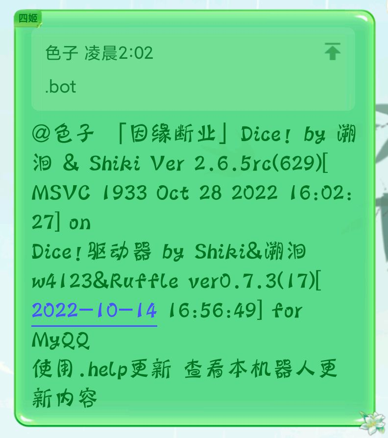
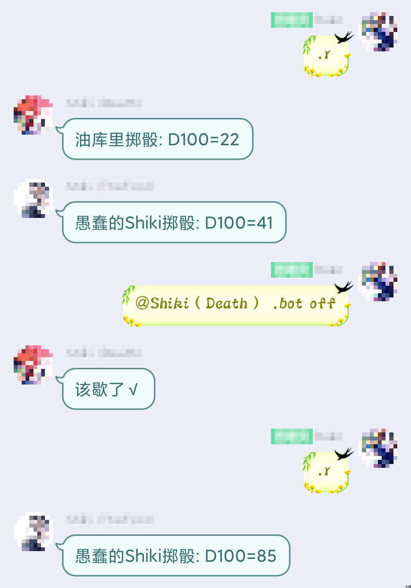

# Dice! 用户手册

本手册对应Dice!2.6.0版本，为用户指令提供说明。管理权限使用的指令请参考[Master手册](https://shiki.stringempty.xyz/Manual/Shiki_Master_Manual.html)。[点此下载本手册](https://shiki.stringempty.xyz/download/Shiki_User_Manual.pdf)

[TOC]

## 注意事项

- 实际指令不需要加任何引号、括号，且以点号(.。!！)开头。
  [参数]指代需要输入的参数，(可选)指代视情况可忽略，当前版本[]仅在st录入掷骰表达式时有意义。
- 除前缀的指令标识符外，其余标点符号均**不能用中文全角代替英文半角**。
- 现在指令刷屏会导致拉黑，请善用多轮鉴定/复数生成指令，注意警告以及时停止。请用.rc 3#手枪代替3次.rc 手枪，用.r3#d10.rd10，用.coc 5 代替5次.coc
- 指令频度达到第三阈值才会自动拉黑，但只要触发第一、第二阈值就会警告并提醒admin
- 为了频度的平滑化，**刷屏统计存在时间滞后**，触发警告后，请冷却半分钟到一分钟

### 裸指令和指名指令

- 停用状态：在群内使用.bot on/off调节，停用状态仅响应!authorize/!warning/.dismiss/.master/.bot指令
- 裸指令：直接以.(。!！)开头发送消息，群内所有非停用状态的骰子都会响应该指令。
- 指名：在指令前@骰子，未指名的骰子将不会响应指令；被指名的骰子如果未关闭DisabledListenAt选项，即使在停用状态也会响应指令；需要对复数骰子发送指令时，可以"@骰子1@骰子2[...@骰子n].指令"；QQ回复消息本身视为开头带一个@

  

## .help 帮助文档
- `.help` 查看帮助(strHlpMsg)
- `.help [词条名]` 查看对应帮助文档

*当词库中不存在同名条目时，会建议最接近的条目

## .bot on/off 指令开关（群聊使用）

用法：`(@骰子).bot (on/off)([骰子QQ或末四位])`

- `.bot`						//群里所有骰子都会应答
- `.bot on 1605271653`			//开启指定骰子
- `@kokona .bot off`					//先at以静默指定骰子
- `.bot off 8350`					//输入QQ末四位与QQ号等效
  //群中只有管理员有权限开关骰子 
  //.bot无视静默状态，只要插件开启且不在内置黑名单总是有效 
  可使用`.help 指令`查看指令列表。

## .reply on/off 关键词回复开关（群聊使用）

用法：`.reply (on/off)`

回复是与指令并列的响应类型，由骰主自定义设置，可使用`.help 回复列表`查看回复关键词列表。

## .dismiss 退群指令

默认协议所允许的将骰子送出群的指令，用于替代违反协议踢出骰子；只有管理员有权限送出骰子；.dismiss无视内置黑名单和静默状态，只要插件开启总是有效，除非群被忽略。

- （群内）`(@骰子).dismiss ([骰子QQ或末四位])` //在想要送出骰娘的群**原地发送**
- （私聊）`.dismiss [要退出的群号] `

## !authorize 申请许可

向开启私用模式或审核模式、需要群【许可使用】的骰娘为群申请授权。受信任用户使用时将直接授权成功，否则申请信息会发送给管理员。

- `!authorize (+[群号]) [申请理由]` //原地为本群申请时可忽略群号。

## .send 发送消息

- `.send [反馈给Master的信息]` 	//将消息发送给Master

## .rules 规则速查

用法：.rules ([规则]):[待查词条] 或.rules set [规则]

- `.rules 跳跃`					//复数规则有相同词条时，择一返回
- `.rules COC：大失败`					//coc默认搜寻coc7的词条
- `.rules dnd：语言`
- `.rules set dnd`					//设置后优先查询dnd同名词条
- `.rules set`					//清空默认规则，一般会先查询coc词条

## .r 普通掷骰指令

用法：.r [掷骰表达式] ([掷骰原因]) 或.r [掷骰原因]
\[掷骰表达式]：(\[掷骰次数]#)\[骰子个数]d\[骰子面数](b[奖励骰个数])(p[惩罚骰个数])(k[取点数最大的骰子数])

- `.r`						//骰子面数默认100，可通过.set修改默认值
- `.r 沙漠之鹰`			//存在录入角色卡时，可调用角色卡中保存的表达式
- `.r 1d4+2 中型刀伤害`				//个数范围1-100，面数范围1-1000，否则非法
- `.r 3d6X5 幸运`						//‘X’或'\*'均视为乘号
- `.r 3#1d6 3发.22伤害`				//每次结果分开发送
- `.r 1d10#	 乌波·萨斯拉的子嗣`				//掷骰次数范围1-10
- `.r3d6k2`						//取点数最大的2个骰子
- `.r3#p 手枪连射`					//奖惩骰固定为一个百面骰，不能与h以外其他字母共存
- `.rb2 瞄准后偷袭`					//2个奖励骰
- `.rh 心理学`					//暗骰，结果通过私聊发送
- `.rs1D10+1D6+3 沙鹰伤害`				//省略单个骰子的点数，直接给结果
  //现版本开头的r不再可用o或d代替
  //一次掷骰超过20个将会自动排序

## .ob 旁观模式

用法：`.ob (exit/list/clr/on/off)`

- `.ob`						//加入旁观可以看到他人暗骰结果
- `.ob exit`						//退出旁观模式
- `.ob list`						//查看群内旁观者
- `.ob clr`						//清除所有旁观者
- `.ob on`						//全群允许旁观模式
- `.ob off`						//禁用旁观模式
  //暗骰与旁观仅在群聊中有效

## .set 设置默认骰

用法：`.set [默认骰子面数]`。如果已绑定角色卡，将修改角色卡的默认骰，否则修改用户配置的默认骰。

- `.set 20`						//合法参数为1-1000
- `.set` 						//重置为默认的D100

## .name 随机昵称

用法：`.name (cn/jp/en)([生成数量])`

- `.name 10`					//默认三类名称随机生成
- `.name en`					//后接cn/jp/en则限定生成中文/日文/英文名

## .nn 设置昵称

用法：`.nn [昵称] / .nn / .nnn (cn/jp/en)`

- `.nn kp`						//掷骰时昵称前的./！等符号会被自动忽略
- `.nn`						//视为删除昵称
- `.nnn`						//设置为随机昵称
- `.nnn jp`						//设置限定随机昵称		
  //私聊时设置的昵称视为全局昵称			
  //每个群的群内昵称是独立的，优先级群内昵称>全局昵称>群名片>QQ昵称

## .coc COC人物作成

用法：.coc([7/6])(d)([生成数量])

- `.coc 10	`					//默认生成7版人物	
- `.coc6d	`					//接d为详细作成，一次只能作成一个
  //仅用作骰点法人物作成，可应用变体规则，参考`.rules创建调查员的其他选项`

## .dnd DND人物作成

用法：.dnd([生成数量])

- `.dnd 5`
  //仅作参考，可自行应用变体规则

## .pc 多角色卡

所有群默认使用同一张初始COC7卡，如要在不同群使用不同卡游戏，需要在群内单独绑卡。每名用户最多可同时保存16张角色卡。

- `.pc new ([模板]:([生成参数]:))([卡名])` //新建空白卡。完全省略参数将生成一张COC7模板的随机姓名卡
- `.pc tag ([卡名])` //为当前群绑定指定卡，为空则解绑使用默认卡。私聊使用将绑定全局默认卡。
- `.pc show ([卡名])` //展示指定卡所有记录的属性，为空则展示当前卡
- `.pc nn [新卡名]` //重命名当前卡，不允许重名
- `.pc cpy [卡名1]=[卡名2]` //将后者属性复制给前者，前者不存在则新建卡
- `.pc del [卡名]` //删除指定卡
- `.pc list` //列出全部角色卡
- `.pc grp` //列出各群绑定卡
- `.pc build ([生成参数]:)(卡名)` //根据模板填充生成属性（COC7为9项主属性）
- `.pc redo ([生成参数]:)(卡名)` //清空原有属性后重新生成
- `.pc clr` //销毁全部角色卡记录
- `.pc stat` //查看角色掷骰统计

## .st 属性录入

用法：`.st (del/clr/show) \[属性名] [属性值]`	//将属性录入当前绑定卡
`.st力量:50 体质:55 体型:65 敏捷:45 外貌:70 智力:75 意志:35 教育:65 幸运:75`

- `.st hp-1`					//+/-开头时，视为基于原值修改
- `.st san+1D6`
- `.st &沙漠之鹰=1D10+1D6+3`  以&开头录入掷骰表达式，可被掷骰指令直接调用
- `.st del kp裁决`					//删除已保存的属性
- `.st clr`						//清空人物卡
- `.st show 灵感`					//查看指定人物属性
- `.st show` 						//无参数时查看所有属性，请使用只st加点过技能的半自动人物卡！
  //部分COC属性会被视为同义词，如智力/灵感、理智/san、侦查/侦察

## .ra/rc 检定指令

用法：.ra/rc ([检定轮数]#)[属性名]	([成功率])	
//角色卡设置了属性时，可省略成功率

- `.rc 困难智力 99`				//困难、极难在技能名开头视为关键词
- `.rc 自动成功爆破`				//自动成功在技能名开头视为关键词，非大失败即成功
- `.rc体质*5`						//允许使用+-\*/，但顺序要求为乘法>加减>除法
- `.rc 敏捷-10`					//修正后成功率必须在1-1000内
- `.rc3#p 手枪`					//轮数与奖惩骰至多9个
  //默认使用规则书检定
  //使用.setcoc以设置默认房规

## .setcoc 设置默认房规

用法：`.setcoc [房规]` //为当前群设置检定房规

- `.setcoc 2` 当前可以设置房规1-5

- `.setcoc` 重置默认规则（规则书）
  0（规则书）
  出1大成功
  不满50出96-100大失败，满50出100大失败
  1
  不满50出1大成功，满50出1-5大成功
  不满50出96-100大失败，满50出100大失败
  2
  出1-5且<=成功率大成功
  出100或出96-99且>成功率大失败
  3
  出1-5大成功
  出96-100大失败
  4
  出1-5且<=成功率/10大成功
  不满50出>=96+成功率/10大失败，满50出100大失败
  5
  出1-2且<成功率/5大成功
  不满50出96-100大失败，满50出99-100大失败

  6

  个位数=十位数且<=成功率则大成功

  个位数=十位数且>成功率则大失败

  *房规2与3的区别在于：初始值为1的技能在②下大成功率只有1，而在③下有5*

##　.log 日志记录

跑团日志记录

- `.log new`  //新建日志并开始记录
- `.log on`  //开始记录
- `.log off`  //暂停记录
- `.log end`  //完成记录并发送日志文件
  日志上传存在失败可能，届时请联系后台管理索取

## .sc 理智检定

用法：`.sc[成功损失]/[失败损失] ([当前san值])	`
//已经.st了理智/san时，可省略最后的参数

- `.sc0/1 70`
- `.sc1d10/1d100 直面外神`
  //当调用角色卡san时，san会自动更新为sc后的剩余值
  //程序上可以损失负数的san，也就是可以用.sc-1d6/-1d6来回复san，但请避免这种奇怪操作
  //大失败自动失去最大san值，大失败由setcoc判定

## .ti/li 疯狂症状

- `.ti` 临时疯狂症状
- `.li` 总结疯狂症状
  //适用coc7版规则，6版请自行用百面骰配合查表

## .en 成长检定
COC规则，用法见.rules
用法：`.en [技能名称]([技能值])`
//已经.st时，可省略最后的参数,调用人物卡属性时，成长后的值会自动更新

- `.en 教育 60 教育增强`		//
- `.en 幸运 +1D3/1D10 幸运成长`	//Pulp规则中的幸运成长

## .ri 先攻掷骰
先攻仅在群聊中有效，自动生成先攻值并从大到小排序
用法：`.ri([加值])([角色名])或.ri([表达式])([角色名])`

- `.ri`						//默认掷骰D20用作DND先攻
- `.ri -1 某pc`			//自动记入先攻列表
- `.ri +5 boss`
  //当参数不以数字或加减号开头时，视为使用自定义表达式
- `.ri2DK`				//允许两次取大的情况						
- `.ri 80` 怪物甲		//只利用先攻排序功能的变体用法
- `.init`					//查看先攻列表
- `.init clr`				//清除先攻列表

## .w 骰池

用法：`.w(w) [骰子个数]a[加骰参数]`
//.w会直接给出结果而.ww会给出每个骰子的点数
//固定10面骰，每有一个骰子点数达到加骰参数，则加骰一次，最后计算点数达到8的骰子数
//具体用法请参考相关游戏规则

## .me 第三人称动作

用法：`.me ([群号]) [动作]`

- `.me 笑出了声`					//仅限群聊使用
- `.me 941980833 抱群主`			//仅限私聊使用，此命令可伪装成骰子在群里说话
- `.me off`						//群内禁用me
- `.me on`				//群内启用me

## .jrrp 今日人品

- `.jrrp`  //今日的人品值(1-100)，每日更换
- `.jrrp off`					//群内禁用jrrp
- `.jrrp on`					//群内启用jrrp
  2.3.5版本后随机值为均匀分布，
  骰娘只负责从服务器搬运结果，请勿无能狂怒
  如何发配所有人的命运，只有孕育万千骰娘生机之母，萌妹吃鱼之神，正五棱双角锥体对的监护人，一切诡秘的窥见者，时空舞台外的逆流者，永转的命运之轮本尊掌握

## .welcome 欢迎词

用法：`.welcome [欢迎词]`  //每有新人入群时将发送欢迎词

- `.welcome {at}欢迎{nick}入群！`		//{at}视为at入群者，{nick}会替换为新人的昵称
- `.welcome`				//清除欢迎词

## .group 群管理操作（仅群管理可用）

用法：群内`.group \[opt]`或私聊`.group \[群号] \[opt]`（两种形式等效）

- `.group state`	//查看在本群的设置及群员信息
- `.group diver`	//列出潜水最深的群员
  //仅群管理可用
- `.group pause`	//群内全局禁言
- `.group restart`	//群内全局禁言解除
- `.group +/-[群管词条]` //为群加减设置
  群管词条:停用指令/禁用回复/禁用jrrp/禁用draw/禁用me/禁用help/禁用ob/拦截消息/
- `.group card [对象QQ/at对象] [群名片]`	//设置群名片。注意名片前的空格
  //仅骰主可用
- `.group ban [at群员/群员QQ] [时长表达式（分钟）]`	//禁言群员，时长小于0时视为解除禁言
- `.group kick [at群员/群员QQ](...+[群员])`	//批量移出群员
- `.group title [授衔对象QQ/at对象] [群头衔]`	//（仅对群主可用）设置群头衔。注意头衔前的空格

## .draw 抽牌

用法：`.draw [牌堆名称] ([抽牌数量])`	//不放回地抽牌；抽牌数量不能超过实例规模

- `.draw _[牌堆名称]`	//暗抽，回复私聊并抄送旁观者
- `.drawh [牌堆名称]`	//暗抽，参数h后必须留空格
  例：`.draw 调查员背景`
  牌堆名称优先调用牌堆实例，如未设置则从同名公共牌堆生成临时实例
  抽到的牌不放回，实例抽空后无法继续
  骰子可以自行配置扩展牌堆，要了解不同骰子配置的具体牌堆，请.help 全牌堆列表或.help 扩展牌堆

## .deck 牌堆

该指令可以在群内自设牌堆，使用.draw时，牌堆实例优先级高于同名公共对象。从牌堆实例抽牌不会放回直到抽空。*每个群的牌堆列表至多保存10个牌堆*

- `.deck set ([牌堆实例名]=)[公共牌堆名]` //从公共牌堆创建实例

- `.deck set ([牌堆实例名]=)member` //从群成员列表创建实例

- `.deck set ([牌堆实例名]=)range [下限] [上限]` //创建等差数列作为实例

- `.deck show` //查看牌堆实例列表

- `.deck show [牌堆名]` //查看剩余卡牌

- `.deck reset [牌堆名]` //重置剩余卡牌

- `.deck clr` //清空所有实例

- `.deck new [牌堆名]=\[卡面1](...|[卡面n])`	//自定义牌堆
  例:

  `.deck new 俄罗斯轮盘=有弹|无弹|无弹|无弹|无弹|无弹`
  除show外其他群内操作需要用户信任或管理权限

# 使用实例

## 实例：使用Dice!跑COC团

### 一、确认检定房规，使用.setcoc群内设置

出于公开公平性考虑，群内房规不受用户私人设置影响，只能在群内为每个群分别.setcoc

### 二、（可选）使用.coc7 生成属性

如使用购点法生成调查员，该步骤可略过。例如kp规定roll十选一，则使用.coc7 10生成10条数据

### 三、在群内绑定参团pc角色卡

如果未录入过pc数据，则使用.pc new新建角色卡，如`.pc new 卡特`，之后使用.st指令录入数据。如果已存在参团角色卡，使用.pc tag绑定到跑团群使用。

### 四、进行游戏

游戏内可使用.rc进行技能检定，.sc进行理智检定，.en进行成长检定，使用形如`.st hp-1`的指令记录属性变化。

## 实例：使用Dice!跑DND团

### 一、使用.set设置默认骰

使用`.set 20`将默认骰设置为D20

### 二、（可选）使用.dnd 生成属性

如使用购点法生成pc，该步骤可略过；如允许属性互换也可自便。

### 三、在群内绑定参团pc角色卡

如果未录入过pc数据，则使用.pc new新建角色卡，如`.pc new DND:Shadow`，之后使用.st指令录入数据。如果已存在参团角色卡，使用.pc tag绑定到跑团群使用。**Dice!不提供DND角色模板，可向确认骰主有无安装扩展**

### 四、进行游戏

游戏内可使用.rd进行检定，.ri进行先攻检定，.init查看先攻列表，使用形如`.st hp-1`的指令记录属性变化。

## 实例：使用Dice!身份抽签（狼人杀）

### 一、选定GM，群内使用.ob进入旁观视角

进入旁观后可以收到群内所有暗骰结果，确保GM知晓每个人的身份

### 二、使用.deck设置身份牌堆

狼人杀需要每个人抽取不放回，因此需要.deck new在群内新建牌堆实例。可以用`::[数目]::[卡面]`的格式表示重名卡牌。例：`.deck new 狼人杀=::3::村民|::3::狼人|预言家|女巫|猎人`

### 三、玩家使用.draw抽取身份

Dice!支持`.drawh 狼人杀`和`.draw_狼人杀`两种暗抽指令格式，注意前者空格不可省略。为保证骰娘能私聊每个玩家成功，建议所有玩家加骰娘好友。

### 四、（可选）玩家使用.ri先攻生成序号

原本.ri用于DND先攻检定，但其生成的有序列表可以用于编号，在所有玩家进行一次.ri后，使用.init list可查看列表。

### 五、开始你的游戏

### 六、使用.deck reset洗牌重复利用

只要玩家人数不变，原牌堆reset重新装填后即可再次使用。